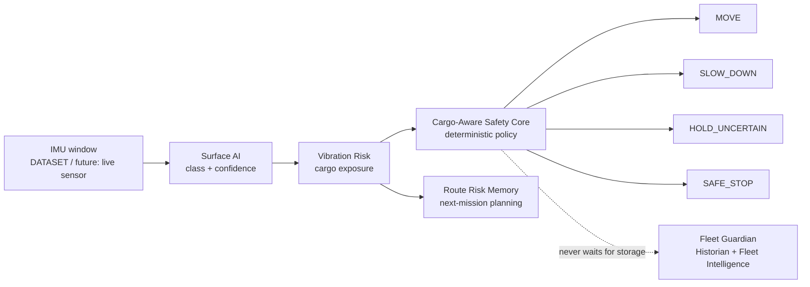

# CargoShield AI

### Cargo protection for autonomous delivery robots

**From Blind Delivery to Cargo-Aware Autonomy**

[ฉบับภาษาไทย](README.md) · [Product Story / poster / demo script](docs/CARGOSHIELD_PRODUCT_STORY.md)

> **AI analyses transport vibration, then adjusts speed, chooses the route, and triggers a Safe Stop
> when the cargo is at risk.**

A conventional delivery robot knows where it must go, but not whether its cargo is being exposed
to damaging vibration. CargoShield AI adds a cargo-protection layer: it classifies the surface from
IMU data, estimates cargo risk, adjusts speed, plans risk-aware routes, and stops safely when the
input is uncertain or unsafe.

> [!IMPORTANT]
> **The current system is a software prototype.** Every displayed record is `DATASET` or
> `SIMULATED`. Nothing in this repository is a live board measurement, real robot location, or
> SLAM output, and the Three.js scene does not represent physical motion.

## Video overview (Thai narration, ~72s)

A walkthrough of what CargoShield AI is and how it works, with Thai voice narration
(synthesized neural TTS), cut from real screenshots of the running system
(`reports/screenshots/after/`) in mission order — not a mock-up animation. On-screen
captions stay bilingual (English + Thai).

[](https://youtu.be/MUtI82VvHp8)

[▶ Watch on YouTube](https://youtu.be/MUtI82VvHp8) ·
[download the backup MP4](reports/media/cargoshield_overview.mp4).

## The problem

Cargo protection introduces risks that ordinary navigation does not see:

- The shortest route may expose fragile cargo to severe vibration.
- Standard and fragile cargo should not use the same speed policy.
- An uncertain model should not guess and keep the robot moving.
- Multi-robot data must remain isolated and auditable without slowing the Safety Core.

CargoShield AI does not replace navigation. It acts as a **Cargo Protection Layer** between sensor
data and motion commands.

## How it works



The decision path is:

1. The model classifies the surface and reports confidence.
2. The engine converts that result into vibration risk for standard or fragile cargo.
3. The Safety Core selects `MOVE`, `SLOW_DOWN`, `HOLD_UNCERTAIN`, or `SAFE_STOP`.
4. Zone risk is retained and used when planning the next mission.
5. Fleet Guardian receives a copy for history and fleet visibility but cannot bypass the Safety Core.

## Project layers

CargoShield AI is one product with three parts under that single name:

```text
CargoShield AI
├── Mission Protection ........... the main surface: cargo protection mission
│   ├── Surface AI ............... surface class from a 128 × 6 IMU window
│   ├── Cargo Policy ............. speed policy per cargo type
│   ├── Safety Core .............. the one decision authority (deterministic)
│   └── Route Risk Memory ........ per-zone risk used to plan the next mission
│
├── 3D Mission Demo .............. the Three.js demonstration surface
│   └── Dataset Replay ........... how data is fed while there is no hardware
│
└── Fleet Guardian ............... fleet monitoring module
    ├── Multi-robot Monitoring
    ├── PostgreSQL Historian
    ├── Fleet Intelligence
    └── Read-only Maintenance Copilot
        └── Hermes integration boundary (not connected)
```

**Fleet Guardian is a module inside CargoShield AI, not a second product**, and
**Dataset Replay is a demonstration method, not a headline capability.**

### Cargo-aware speed policy

| Vibration risk | Standard cargo | Fragile cargo |
| --- | --- | --- |
| low | 100% | 80% |
| medium | 75% | 45% |
| high | 50% | 25% |

Fragile cargo always travels slower at equal risk (`cargo/decision_engine.py`).

| Layer | Responsibility | Current data |
| --- | --- | --- |
| **Mission Protection** | Surface AI, confidence gate, cargo policy, Safety Core, and route-risk memory | Dataset Replay |
| **3D Mission Console** | Robot, route, risk-zone, decision, and demo-control visualization | Python Engine state visualization |
| **Fleet Guardian** | Per-robot isolation, malformed-data detection, and decisions that survive Historian outage | Simulation |
| **Fleet Historian** | Queued PostgreSQL persistence for telemetry, predictions, events, and missions | Dataset / Simulation |
| **Fleet Intelligence** | Fleet overview, history, and provenance | Dataset / Simulation |
| **Maintenance Assistant** | Answers seven curated questions from literal `SELECT` statements over a read-only role, always citing evidence rows | Dataset / Simulation; **Hermes is not connected** |

## What makes it different

- **It protects the cargo, not only the route completion.** Policy changes with cargo fragility.
- **Uncertainty cannot silently become motion.** Predictions below the threshold become
  `HOLD_UNCERTAIN`.
- **Unsafe events require an operator.** `SAFE_STOP` stays latched until `manual_resume`.
- **Risk learning never rewrites a route mid-mission.** A running route remains fixed; the next
  mission may be replanned.
- **Storage and copilots stay outside emergency control.** The Safety Core continues when the
  Historian is unavailable.
- **The architecture already models multiple robots.** State is isolated and checked for duplicate,
  out-of-order, jumping, and non-finite values.

## How the dataset is used

The dataset is not used only for training. Groups are split without overlap:

| Split | Purpose |
| --- | --- |
| Train | Fit the RandomForest and derive vibration-risk boundaries |
| Validation | Select the confidence threshold and supply Dataset Replay windows |
| Test | Produce final metrics in `reports/metrics.json` only |

**Dataset Replay** feeds recorded IMU windows through the pipeline in sequence to demonstrate
system decisions. It is not live measurement, and it does not replay the held-out test split.

Latest held-out test results:

| Metric | Result |
| --- | ---: |
| Macro F1 | 0.5156 |
| Weighted F1 | 0.5449 |
| Confidence threshold | 0.55 |
| Accuracy on accepted windows | 0.7210 |
| Coverage | 52.8% |

Windows below the threshold become `HOLD_UNCERTAIN`; they are not presented as safe decisions.
Per-class results and limitations are documented in
[`docs/ML_EVALUATION.md`](docs/ML_EVALUATION.md).

## Recommended demo

1. Select **fragile cargo** and start Dataset Replay.
2. Point out Surface AI, confidence, vibration risk, and the speed ratio.
3. Set the simulated obstacle to 50 cm to demonstrate `SLOW_DOWN`.
4. Set it to 20 cm to demonstrate a latched `SAFE_STOP`.
5. Open Fleet Guardian to show robot isolation, history, and provenance.
6. Scroll to **Maintenance Assistant** and press one of the curated questions, to show an answer
   with its evidence rows and the `READ-ONLY` / `HUMAN APPROVAL REQUIRED` /
   `Hermes provider: Not connected` badges.

A timed 60–90 second demo script is in
[`docs/CARGOSHIELD_PRODUCT_STORY.md`](docs/CARGOSHIELD_PRODUCT_STORY.md).

The honest presentation is: **“This is a pipeline and safety-behavior prototype verified with
recorded data and simulation.”** It is not hardware evidence.

## Quick start

### 1. Install

```powershell
python -m venv .venv
.\.venv\Scripts\python.exe -m pip install -r requirements.txt
.\.venv\Scripts\python.exe -m playwright install chromium
```

### 2. Prepare PostgreSQL

```powershell
docker compose up -d
.\.venv\Scripts\python.exe -m cargo.db
```

Docker Compose loads `.env` automatically, so copy `.env.example` to `.env` when overriding its
database settings. Python commands read the process environment directly and do not load `.env`;
set the `CARGOSHIELD_PG_*` variables in PowerShell when running Python outside Compose.

### 3. Run

An MQTT broker must listen on `127.0.0.1:1883`, with MQTT-over-WebSocket on
`127.0.0.1:8883`.

```powershell
# Python Engine for the Dataset Replay mission
.\.venv\Scripts\python.exe -m cargo.mqtt_service

# Fleet Guardian and read-only History API
.\.venv\Scripts\python.exe -m cargo.fleet_service
.\.venv\Scripts\python.exe -m cargo.history_api --port 8099

# Web surfaces
.\.venv\Scripts\python.exe -m http.server 8080 --bind 127.0.0.1 --directory webapp
```

- Mission Protection: <http://127.0.0.1:8080/index.html>
- Fleet Guardian: <http://127.0.0.1:8080/fleet.html>

The mission-start button publishes `{"action":"start"}` to
`cargoshield/cargo-robot-01/command` and replays ten validation windows in about ten seconds.

### 4. Run the fleet demo

```powershell
.\.venv\Scripts\python.exe scripts\fleet_scenario.py
```

The scenario runs three simulated robots concurrently: a healthy robot, one that accumulates
vibration and impact until Safe Stop, and one that emits faulty data. PostgreSQL is deliberately
removed mid-run to prove that the Safety Core keeps deciding. Evidence is written to
`reports/fleet_scenario_evidence.json`.

## Regenerate the dataset and model artifacts

```powershell
.\.venv\Scripts\python.exe -m training.prepare_dataset
.\.venv\Scripts\python.exe -m training.train_baseline
.\.venv\Scripts\python.exe -m training.select_confidence
.\.venv\Scripts\python.exe -m training.evaluate_baseline
```

## Verification

```powershell
.\.venv\Scripts\python.exe -m pytest -q
.\.venv\Scripts\python.exe -m compileall -q cargo training scripts tests
.\.venv\Scripts\python.exe scripts\smoke_mqtt_flow.py --dataset-demo
.\.venv\Scripts\python.exe scripts\demo_e2e_check.py
.\.venv\Scripts\python.exe scripts\fleet_scenario.py
.\.venv\Scripts\python.exe scripts\webapp_ui_check.py --url "http://127.0.0.1:8080/?device=ui-verify"
.\.venv\Scripts\python.exe -m pip_audit -r requirements.txt
```

Revalidation on commit `6a9153d` passed **177 tests + 174 subtests**, `compileall`, and
`pip-audit` with no known vulnerabilities. The latest checked-in end-to-end evidence records
MQTT E2E **14/14**, Fleet Scenario **12/12**, and browser verification with no console errors.
Every latency number is from the local simulator, not board performance.

Browser evidence covers `IDLE`, `MOVING`, `HOLD_UNCERTAIN`, `SLOW_DOWN`, `SAFE_STOPPED`,
`COMPLETED`, Overview/Follow/Robot POV cameras, Fleet Guardian, the Maintenance Assistant,
1920×1080, 1440×900, 1280×720, an effective 200% zoom viewport, and the no-WebGL and
reduced-motion fallbacks. Before/after images are in `reports/screenshots/before/` and
`reports/screenshots/after/`. The latest browser evidence records **180 fps (the median of five
samples)** on an RTX 4050. This is a web-rendering figure, never board inference performance.

Safety Events and Mission History paginate independently with at most 20 rows per page. Event
filters reset only the event page. CSV downloads use the active filter, fixed column order,
RFC 4180 escaping, an Excel-compatible UTF-8 BOM, and apostrophe-prefix cells beginning with
`=`, `+`, `-`, or `@` so spreadsheet software does not evaluate database text as a formula.

## Current boundaries

- No live board sensor ingestion or on-board benchmark has been demonstrated.
- No motor control, physical motion, localization, SLAM, camera, microphone, or range sensor exists.
- The Three.js scene is a visualization, not a Digital Twin bound to physical position.
- Maintenance Copilot/Hermes is not integrated and must remain read-only if added.
- The current ML model is a baseline and some classes remain weak.

See [`docs/KNOWN_LIMITATIONS.md`](docs/KNOWN_LIMITATIONS.md) for the complete list.

## Main documentation

| Document | Contents |
| --- | --- |
| [`docs/CARGOSHIELD_PRODUCT_STORY.md`](docs/CARGOSHIELD_PRODUCT_STORY.md) | Pitch, demo script, poster layout, and usable vs prohibited claims |
| [`docs/FLEET_GUARDIAN_FINAL_REPORT.md`](docs/FLEET_GUARDIAN_FINAL_REPORT.md) | Architecture, evidence, verification, and prohibited claims |
| [`docs/CARGOSHIELD_ARCHITECTURE.md`](docs/CARGOSHIELD_ARCHITECTURE.md) | CargoShield structure and layer boundaries |
| [`docs/ML_EVALUATION.md`](docs/ML_EVALUATION.md) | Data splits, held-out metrics, and confidence selection |
| [`docs/KNOWN_LIMITATIONS.md`](docs/KNOWN_LIMITATIONS.md) | Unimplemented and unverified capabilities |
| [`docs/HARDWARE_EXPANSION_MATRIX.md`](docs/HARDWARE_EXPANSION_MATRIX.md) | Evidence required before camera, microphone, range, or motor expansion |
| [`docs/HERMES_MAINTENANCE_COPILOT.md`](docs/HERMES_MAINTENANCE_COPILOT.md) | Read-only copilot boundary |
| [`docs/CARGOSHIELD_VISUAL_FLOW_RUNBOOK.md`](docs/CARGOSHIELD_VISUAL_FLOW_RUNBOOK.md) | MQTT, Bitstream Sensor Studio, and build limits |
| [`แนวทางพัฒนาต่อ.md`](แนวทางพัฒนาต่อ.md) | Suggested next work, robot-arm concept, and optional Hermes Agent boundary |
