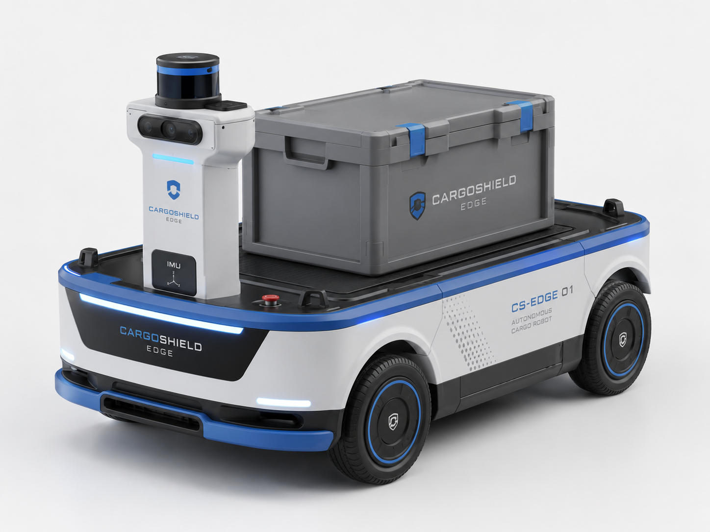
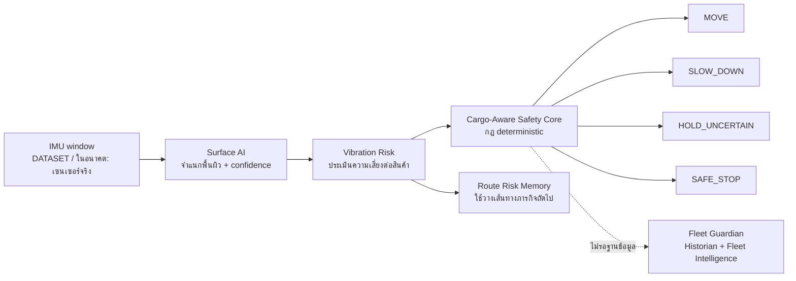

# CargoShield AI

### ระบบปกป้องสินค้าเปราะบางสำหรับหุ่นยนต์ขนส่ง

**From Blind Delivery to Cargo-Aware Autonomy**

[English version](README%28EN%29.md) · [Product Story / โครงโปสเตอร์ / Demo script](docs/CARGOSHIELD_PRODUCT_STORY.md)

> **AI วิเคราะห์แรงสั่นสะเทือนระหว่างขนส่ง แล้วปรับความเร็ว เลือกเส้นทาง
> และ Safe Stop เมื่อพบความเสี่ยงต่อสินค้า**

หุ่นยนต์ขนส่งทั่วไปมักรู้เพียงว่า “ต้องไปถึงจุดหมาย” แต่ไม่รู้ว่าสินค้าบนตัวกำลังได้รับแรงสั่นสะเทือนมากเกินไปหรือไม่
CargoShield AI จึงเพิ่มชั้นการปกป้องสินค้าให้หุ่นยนต์: วิเคราะห์พื้นผิวจากข้อมูล IMU ประเมินความเสี่ยงต่อสินค้า
ปรับความเร็ว เลือกเส้นทาง และหยุดอย่างปลอดภัยเมื่อข้อมูลไม่น่าเชื่อถือหรือพบเหตุอันตราย

> [!IMPORTANT]
> **สถานะปัจจุบันคือ Software Prototype:** ข้อมูลที่แสดงเป็น `DATASET` หรือ `SIMULATED`
> ไม่ใช่การวัดสดจากบอร์ดหรือหุ่นยนต์จริง และฉาก Three.js ไม่ใช่ตำแหน่งจริงหรือ SLAM

## รูปลักษณ์เป้าหมายโดยประมาณ



> [!NOTE]
> ภาพนี้เป็น **Concept Render** เพื่อสื่อรูปลักษณ์เป้าหมายของหุ่นยนต์ขนส่ง ชุดตรวจจับ และกล่องสินค้า
> ไม่ใช่ภาพฮาร์ดแวร์ต้นแบบที่สร้างเสร็จแล้ว ระบบใน repository นี้ยังเป็น Software Prototype
> ส่วน workflow ตั้งแต่ข้อมูล IMU ไปจนถึง Safety Core, Route Risk Memory และ Fleet Guardian แสดงในหัวข้อ
> [ระบบทำงานอย่างไร](#ระบบทำงานอย่างไร)

## วิดีโอแนะนำโปรแกรม (2 นาที)

วิดีโอสรุปการทำงานของ CargoShield AI พร้อมเสียงบรรยายและคำบรรยายภาษาไทย
ตัดต่อจากภาพหน้าจอที่บันทึกใหม่จากโปรแกรมบน commit `acc5931`
โดยระบุขอบเขต `DATASET` / `SIMULATED` และแยกความสามารถปัจจุบันออกจากส่วนที่เสนอไว้

[](https://youtu.be/OJv_-qu4fCI)

[▶ รับชมวิดีโอแนะนำโปรแกรมบน YouTube](https://youtu.be/OJv_-qu4fCI)

เมื่อเปิดหน้าเว็บในเครื่องแล้ว ดูวิดีโอในหน้าเดียวได้ที่ <http://127.0.0.1:8080/video.html>

## ปัญหาที่ต้องการแก้

การขนส่งสินค้าเปราะบางมีความเสี่ยงที่ระบบนำทางทั่วไปมองไม่เห็น:

- เส้นทางที่สั้นที่สุดอาจมีพื้นผิวสั่นสะเทือนสูง
- สินค้าทั่วไปกับสินค้าเปราะบางไม่ควรใช้ความเร็วและนโยบายเดียวกัน
- โมเดลที่ไม่มั่นใจไม่ควรสั่งให้หุ่นยนต์เคลื่อนที่ต่อแบบเดาสุ่ม
- ข้อมูลจากหุ่นยนต์หลายตัวต้องแยกจากกัน ตรวจสอบย้อนหลังได้ และต้องไม่ทำให้ Safety Core ช้าลง

CargoShield AI ไม่ได้แทนระบบนำทาง แต่ทำหน้าที่เป็น **Cargo Protection Layer**
ระหว่างข้อมูลเซนเซอร์กับคำสั่งเคลื่อนที่

## ระบบทำงานอย่างไร



ลำดับการตัดสินใจหลัก:

1. โมเดลจำแนกพื้นผิวและรายงานระดับความมั่นใจ
2. ระบบแปลงผลเป็นความเสี่ยงแรงสั่นต่อสินค้าทั่วไปหรือสินค้าเปราะบาง
3. Safety Core เลือก `MOVE`, `SLOW_DOWN`, `HOLD_UNCERTAIN` หรือ `SAFE_STOP`
4. ความเสี่ยงของแต่ละโซนถูกจดจำเพื่อวางเส้นทางใหม่เมื่อเริ่มภารกิจถัดไป
5. Fleet Guardian รับสำเนาข้อมูลเพื่อดูย้อนหลัง โดยไม่มีสิทธิ์ข้าม Safety Core

## ส่วนประกอบของโปรเจกต์

CargoShield AI เป็นผลิตภัณฑ์เดียว มีสามส่วนอยู่ภายใต้ชื่อนี้:

```text
CargoShield AI
├── Mission Protection ........... หน้าหลัก: ภารกิจปกป้องสินค้า
│   ├── Surface AI ............... จำแนกพื้นผิวจากหน้าต่าง IMU 128 × 6
│   ├── Cargo Policy ............. นโยบายความเร็วตามประเภทสินค้า
│   ├── Safety Core .............. ผู้ตัดสินใจเพียงผู้เดียว (deterministic)
│   └── Route Risk Memory ........ จำความเสี่ยงรายโซนไว้วางเส้นทางรอบหน้า
│
├── 3D Mission Demo .............. หน้าจอสาธิต Three.js
│   └── Dataset Replay ........... วิธีป้อนข้อมูลเมื่อยังไม่มีฮาร์ดแวร์
│
└── Fleet Guardian ............... โมดูลติดตามกองหุ่นยนต์
    ├── Multi-robot Monitoring
    ├── PostgreSQL Historian
    ├── Fleet Intelligence
    └── Read-only Maintenance Copilot
        └── Hermes integration boundary (ยังไม่เชื่อมต่อ)
```

**Fleet Guardian เป็นโมดูลภายใต้ CargoShield AI ไม่ใช่ผลิตภัณฑ์แยก**
และ **Dataset Replay เป็นวิธีสาธิต ไม่ใช่ความสามารถหลักของผลิตภัณฑ์**

### นโยบายความเร็วตามประเภทสินค้า

| ความเสี่ยงแรงสั่น | สินค้าทั่วไป | สินค้าเปราะบาง |
| --- | --- | --- |
| low | 100% | 80% |
| medium | 75% | 45% |
| high | 50% | 25% |

สินค้าเปราะบางเดินทางช้ากว่าเสมอที่ความเสี่ยงเท่ากัน (`cargo/decision_engine.py`)

| ชั้นระบบ | หน้าที่ | สถานะข้อมูล |
| --- | --- | --- |
| **Mission Protection** | Surface AI, confidence gate, cargo policy, Safety Core และ route-risk memory | Dataset Replay |
| **3D Mission Console** | แสดงหุ่นยนต์ เส้นทาง โซนเสี่ยง การตัดสินใจ และควบคุมเดโม | Visualization จาก state ของ Python Engine |
| **Fleet Guardian** | แยกสถานะหุ่นยนต์หลายตัว ตรวจข้อมูลผิดปกติ และคงการตัดสินใจแม้ Historian ล่ม | Simulation |
| **Fleet Historian** | เก็บ telemetry, prediction, event และ mission ใน PostgreSQL ผ่านคิวที่ไม่บล็อก Safety Core | Dataset / Simulation |
| **Fleet Intelligence** | ดูภาพรวมกองหุ่นยนต์ ประวัติ และหลักฐาน provenance | Dataset / Simulation |
| **Maintenance Assistant** | ตอบ 7 คำถามบำรุงรักษาจาก SQL แบบ `SELECT` พร้อมแถวหลักฐาน ผ่าน role ที่อ่านได้อย่างเดียว | Dataset / Simulation; **Hermes ยังไม่เชื่อมต่อ** |

## จุดที่ต่างจากเดโมหุ่นยนต์ทั่วไป

- **ปกป้องสินค้า ไม่ใช่แค่พาหุ่นยนต์ไปถึงปลายทาง** — นโยบายเปลี่ยนตามความเปราะบางของสินค้า
- **ไม่มั่นใจก็ไม่ฝืนเคลื่อนที่** — ผลต่ำกว่า confidence threshold กลายเป็น `HOLD_UNCERTAIN`
- **เหตุอันตรายต้องให้คนปลด** — `SAFE_STOP` ถูก latch จนผู้ควบคุมสั่ง `manual_resume`
- **เรียนรู้ความเสี่ยงโดยไม่เปลี่ยนเส้นทางกลางภารกิจ** — เส้นทางคงที่ระหว่างรัน และวางใหม่ในรอบถัดไป
- **ฐานข้อมูลหรือ Copilot ไม่อยู่ในวงจรตัดสินใจฉุกเฉิน** — Safety Core ทำงานต่อได้เมื่อ Historian ใช้งานไม่ได้
- **รองรับแนวคิดหลายหุ่นยนต์** — แยก state และตรวจ duplicate, out-of-order, jump และค่าที่ไม่เป็นตัวเลข

## Dataset ใช้ทำอะไร

Dataset ไม่ได้ใช้เพื่อเทรนอย่างเดียว แต่แบ่งตามกลุ่มโดยไม่ให้ข้อมูลทับกัน:

| Split | หน้าที่ |
| --- | --- |
| Train | ฝึก RandomForest และสร้างขอบเขต vibration risk |
| Validation | เลือก confidence threshold และเป็นแหล่งข้อมูลสำหรับ Dataset Replay |
| Test | ประเมินผลสุดท้ายและเขียนผลลง `reports/metrics.json` เท่านั้น |

**Dataset Replay** คือการป้อนหน้าต่าง IMU ที่บันทึกไว้เข้า pipeline ตามลำดับเวลา
เพื่อสาธิตการตัดสินใจของระบบ ไม่ใช่การวัดสด และไม่ใช่การนำ test split มาเล่นเป็นเดโม

ผลบน held-out test split ล่าสุด:

| ตัวชี้วัด | ผล |
| --- | ---: |
| Macro F1 | 0.5156 |
| Weighted F1 | 0.5449 |
| Confidence threshold | 0.55 |
| Accuracy ของหน้าต่างที่ระบบยอมตัดสินใจ | 0.7210 |
| Coverage | 52.8% |

หน้าต่างที่ไม่ผ่าน threshold จะถูกเปลี่ยนเป็น `HOLD_UNCERTAIN` ไม่ถูกนับเป็นการตัดสินใจที่ปลอดภัย
รายละเอียดและข้อจำกัดของแต่ละคลาสอยู่ใน [`docs/ML_EVALUATION.md`](docs/ML_EVALUATION.md)

## เดโมที่แนะนำ

1. เลือกสินค้า **เปราะบาง** แล้วเริ่ม Dataset Replay
2. ชี้ให้เห็น Surface AI, confidence, vibration risk และการปรับ speed ratio
3. กำหนดสิ่งกีดขวางที่ 50 ซม. เพื่อสาธิต `SLOW_DOWN`
4. กำหนดที่ 20 ซม. เพื่อสาธิต `SAFE_STOP` และการ latch
5. เปิด Fleet Guardian เพื่อแสดงการแยกหุ่นยนต์ ประวัติ และ provenance
6. เลื่อนไป **Maintenance Assistant** กดคำถามที่ระบบรองรับ เพื่อแสดงคำตอบพร้อมแถวหลักฐาน
   และป้าย `READ-ONLY` / `HUMAN APPROVAL REQUIRED` / `Hermes provider: Not connected`

Demo script แบบจับเวลา 60–90 วินาทีอยู่ใน
[`docs/CARGOSHIELD_PRODUCT_STORY.md`](docs/CARGOSHIELD_PRODUCT_STORY.md)

ข้อความที่ควรใช้กับกรรมการคือ **“นี่คือ pipeline และ safety behavior ที่พิสูจน์ด้วยข้อมูลบันทึกและ simulation”**
ไม่ใช่ผลจากฮาร์ดแวร์จริง

## เริ่มต้นใช้งาน

### 1. ติดตั้ง

```powershell
python -m venv .venv
.\.venv\Scripts\python.exe -m pip install -r requirements.txt
.\.venv\Scripts\python.exe -m playwright install chromium
```

### 2. เตรียม PostgreSQL

```powershell
docker compose up -d
.\.venv\Scripts\python.exe -m cargo.db
```

Docker Compose อ่านไฟล์ `.env` อัตโนมัติ จึงคัดลอก `.env.example` เป็น `.env` ได้เมื่อต้องการ
เปลี่ยนค่าฐานข้อมูล ส่วนคำสั่ง Python อ่าน environment ของ process โดยตรงและไม่ได้โหลด `.env`
เอง หากรัน Python นอก Compose ให้ตั้งตัวแปร `CARGOSHIELD_PG_*` ใน PowerShell ก่อน

### 3. เปิดระบบ

ต้องมี MQTT broker ที่ `127.0.0.1:1883` และ MQTT-over-WebSocket ที่ `127.0.0.1:8883`

```powershell
# Python Engine สำหรับภารกิจ Dataset Replay
.\.venv\Scripts\python.exe -m cargo.mqtt_service

# Fleet Guardian และ History API แบบอ่านอย่างเดียว
.\.venv\Scripts\python.exe -m cargo.fleet_service
.\.venv\Scripts\python.exe -m cargo.history_api --port 8099

# หน้าเว็บ
.\.venv\Scripts\python.exe -m http.server 8080 --bind 127.0.0.1 --directory webapp
```

- ภารกิจปกป้องสินค้า (Mission Protection): <http://127.0.0.1:8080/index.html>
- Fleet Guardian: <http://127.0.0.1:8080/fleet.html>

ปุ่มเริ่มภารกิจส่ง `{"action":"start"}` ไปที่ `cargoshield/cargo-robot-01/command`
และ replay 10 validation windows ภายในประมาณ 10 วินาที

### 4. เดโมหลายหุ่นยนต์

```powershell
.\.venv\Scripts\python.exe scripts\fleet_scenario.py
```

scenario จำลองหุ่นยนต์สามตัวพร้อมกัน: ตัวปกติ ตัวที่สะสมแรงสั่น/impact จน Safe Stop
และตัวที่ส่งข้อมูลผิดปกติ พร้อมตัด PostgreSQL ชั่วคราวเพื่อพิสูจน์ว่า Safety Core ยังตัดสินใจต่อได้
หลักฐานถูกเขียนลง `reports/fleet_scenario_evidence.json`

## สร้าง Dataset และโมเดลใหม่

```powershell
.\.venv\Scripts\python.exe -m training.prepare_dataset
.\.venv\Scripts\python.exe -m training.train_baseline
.\.venv\Scripts\python.exe -m training.select_confidence
.\.venv\Scripts\python.exe -m training.evaluate_baseline
```

## การตรวจสอบ

```powershell
.\.venv\Scripts\python.exe -m pytest -q
.\.venv\Scripts\python.exe -m compileall -q cargo training scripts tests
.\.venv\Scripts\python.exe scripts\smoke_mqtt_flow.py --dataset-demo
.\.venv\Scripts\python.exe scripts\demo_e2e_check.py
.\.venv\Scripts\python.exe scripts\fleet_scenario.py
.\.venv\Scripts\python.exe scripts\webapp_ui_check.py --url "http://127.0.0.1:8080/?device=ui-verify"
.\.venv\Scripts\python.exe -m pip_audit -r requirements.txt
```

ผลที่ตรวจซ้ำบน commit `6a9153d`: **177 tests + 174 subtests**, `compileall` ผ่าน และ
`pip-audit` ไม่พบช่องโหว่ที่รู้จัก ส่วนหลักฐาน end-to-end ที่เก็บใน repository ล่าสุดคือ
MQTT E2E **14/14**, Fleet Scenario **12/12** และ browser verification ไม่มี console error
ตัวเลข latency ทั้งหมดเป็นผลจาก local simulator ไม่ใช่ประสิทธิภาพของบอร์ด

Browser evidence ครอบคลุมสถานะ `IDLE`, `MOVING`, `HOLD_UNCERTAIN`, `SLOW_DOWN`, `SAFE_STOPPED`,
`COMPLETED`, กล้อง Overview/Follow/Robot POV, หน้า Fleet Guardian, Maintenance Assistant,
ความละเอียด 1920×1080, 1440×900 และ 1280×720, effective viewport ที่ 200% zoom,
รวมถึงโหมด no-WebGL และ reduced-motion — ภาพก่อน/หลังอยู่ใน
`reports/screenshots/before/` และ `reports/screenshots/after/`
หลักฐาน browser ล่าสุดบันทึก **180 fps (median จาก 5 samples)** บน GPU จริง (RTX 4050)
ค่านี้เป็นการเรนเดอร์หน้าเว็บ
ไม่ใช่ประสิทธิภาพการ inference ของบอร์ด

ตาราง Safety Events และ Mission History แบ่งหน้าแยกกันหน้าละไม่เกิน 20 แถว
ตัวกรองเหตุการณ์จะรีเซ็ตเฉพาะหน้าของเหตุการณ์ และ CSV ใช้ลำดับคอลัมน์คงที่,
RFC 4180, UTF-8 BOM สำหรับ Excel และเติม apostrophe หน้าเซลล์ที่อาจถูกตีความเป็นสูตร
(`=`, `+`, `-`, `@`) การดาวน์โหลดใช้ตัวกรองที่กำลังแสดงอยู่

## ขอบเขตที่ยังไม่มี

- ยังไม่มีการอ่านเซนเซอร์สดจากบอร์ดและยังไม่มีผล benchmark บนบอร์ด
- ยังไม่มีมอเตอร์ การเคลื่อนที่จริง localization, SLAM, กล้อง ไมโครโฟน หรือเซนเซอร์ระยะ
- ฉาก Three.js เป็น visualization ไม่ใช่ Digital Twin ที่ผูกกับตำแหน่งจริง
- Maintenance Copilot/Hermes ยังไม่เชื่อมใช้งานจริง และจะต้องคงสิทธิ์แบบ read-only
- ผล ML ปัจจุบันเป็น baseline และบางคลาสยังจำแนกได้ไม่ดี
- Secure Edge มีเอกสารออกแบบที่แยก CURRENT/PROPOSED แล้ว แต่ยังไม่มี OPTIGA, mTLS,
  Secure Boot หรือ Protected Update ที่ deploy และพิสูจน์บนบอร์ดจริง

ดูรายการข้อจำกัดฉบับเต็มที่ [`docs/KNOWN_LIMITATIONS.md`](docs/KNOWN_LIMITATIONS.md)

## เอกสารหลัก

| เอกสาร | เนื้อหา |
| --- | --- |
| [`docs/CARGOSHIELD_PRODUCT_STORY.md`](docs/CARGOSHIELD_PRODUCT_STORY.md) | Pitch, demo script, โครงโปสเตอร์ และ claim ที่ใช้ได้/ห้ามใช้ |
| [`docs/FLEET_GUARDIAN_FINAL_REPORT.md`](docs/FLEET_GUARDIAN_FINAL_REPORT.md) | สถาปัตยกรรม หลักฐาน ผลตรวจ และ claim ที่ห้ามใช้ |
| [`docs/CARGOSHIELD_ARCHITECTURE.md`](docs/CARGOSHIELD_ARCHITECTURE.md) | โครงสร้าง CargoShield และขอบเขตของแต่ละชั้น |
| [`docs/ML_EVALUATION.md`](docs/ML_EVALUATION.md) | Data split, held-out metrics และ confidence selection |
| [`docs/KNOWN_LIMITATIONS.md`](docs/KNOWN_LIMITATIONS.md) | ความสามารถที่ยังไม่มีหรือยังไม่ยืนยัน |
| [`docs/CARGOSHIELD_SECURE_EDGE_DESIGN.md`](docs/CARGOSHIELD_SECURE_EDGE_DESIGN.md) | Threat model, OPTIGA/mTLS/Secure Boot **แบบออกแบบ ยังไม่ได้ deploy** (CURRENT/PROPOSED) |
| [`docs/HARDWARE_EXPANSION_MATRIX.md`](docs/HARDWARE_EXPANSION_MATRIX.md) | หลักฐานที่ต้องมีก่อนเพิ่มกล้อง ไมค์ ระยะ หรือมอเตอร์ |
| [`docs/HERMES_MAINTENANCE_COPILOT.md`](docs/HERMES_MAINTENANCE_COPILOT.md) | ขอบเขต Copilot แบบอ่านอย่างเดียว |
| [`docs/CARGOSHIELD_VISUAL_FLOW_RUNBOOK.md`](docs/CARGOSHIELD_VISUAL_FLOW_RUNBOOK.md) | MQTT, Bitstream Sensor Studio และข้อจำกัดของ build |
| [`แนวทางพัฒนาต่อ.md`](แนวทางพัฒนาต่อ.md) | งานที่ควรทำต่อ ไอเดียแขนกล และแนวทางเพิ่ม Hermes Agent |
