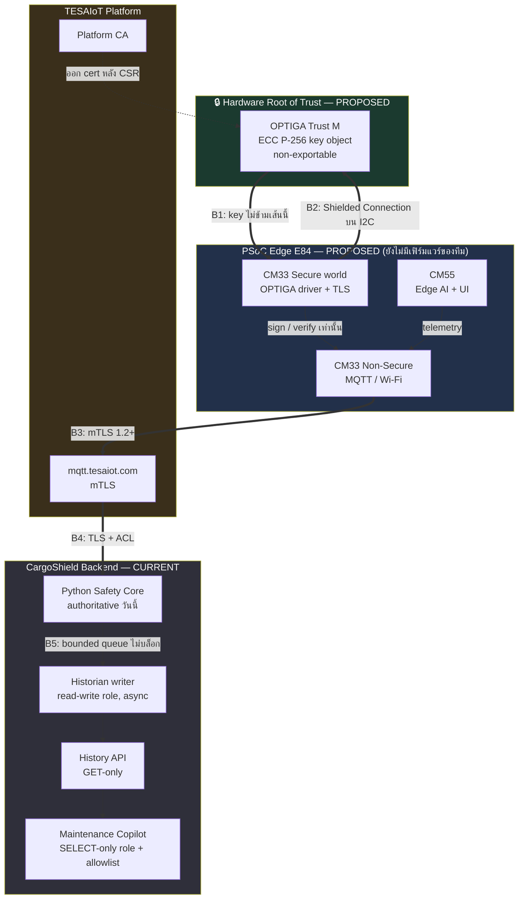
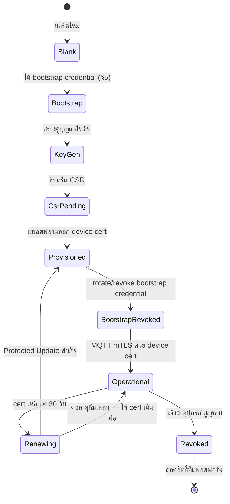
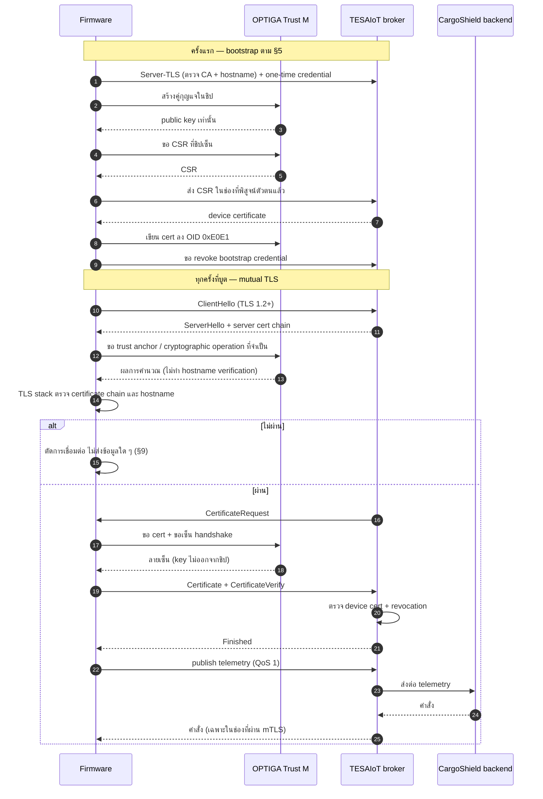
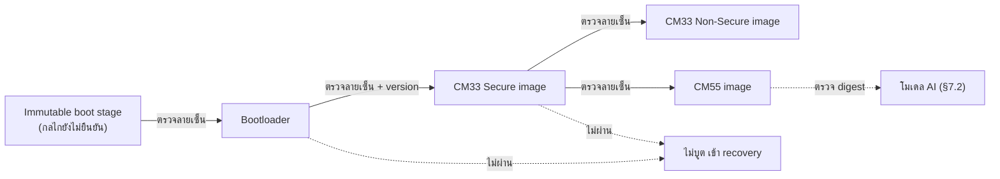
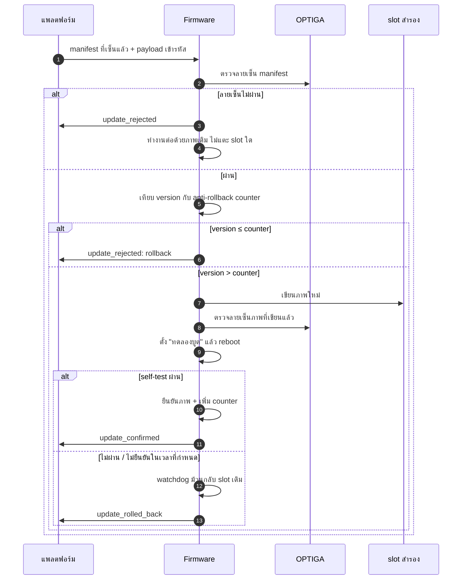

# CargoShield Secure Edge Design

**เอกสารออกแบบ ไม่ใช่รายงานผลการติดตั้ง** — รองรับเกณฑ์ 2.3 (Secure Edge) ของ TESAIoT 2026

> [!IMPORTANT]
> **ยังไม่มีบอร์ด KIT_PSE84_AI ในมือ** ทุกอย่างที่เกี่ยวกับ OPTIGA™ Trust M, mTLS, Secure Boot
> และ Protected Update ในเอกสารนี้มีสถานะ **PROPOSED** ทั้งหมด ยังไม่ได้ติดตั้ง ยังไม่ได้แฟลช
> ยังไม่ได้ทดสอบกับฮาร์ดแวร์จริง และเอกสารนี้ **ไม่มี** ผลทดสอบ log หรือภาพจากบอร์ด
> สิ่งที่ทำงานจริงวันนี้คือ Python engine + MQTT broker บน loopback แบบ **plaintext ไม่มี TLS**

---

## 1. Baseline ปัจจุบัน (ตรวจจากซอร์สโค้ด)

| ด้าน | สิ่งที่มีจริงวันนี้ | ที่มา |
| --- | --- | --- |
| Transport | MQTT plaintext `127.0.0.1:1883` (TCP), `:8883` (WebSocket) | `cargo/mqtt_service.py:196-206`, `cargo/fleet_service.py:148-162` |
| TLS / mTLS | **ไม่มี** — ไม่มี `tls_set()` หรือการอ้างไฟล์ CA/cert ที่ใดใน `cargo/` | grep `tls\|ssl\|cert` ใน `cargo/` ไม่พบ |
| Device identity | **ไม่มี** — `device_id` เป็นสตริงจาก CLI ไม่มีการพิสูจน์เชิงเข้ารหัส | `cargo/mqtt_service.py:198` |
| Mission command auth | **ไม่มีเลย** — `handle_command()` รับทุก payload บน command topic รวมทั้ง `manual_resume` | `cargo/mqtt_service.py:102-129` |
| Fleet command auth | shared payload token แบบ **optional** (`--command-token`) ตรวจฟิลด์ `token` ใน payload | `cargo/fleet_service.py:84-86,150` |
| Historian → PostgreSQL | **writer แบบ read-write** ใช้ role เจ้าของฐานข้อมูล (`settings_from_env()`) เขียนแบบ async ผ่านคิวมีขอบเขต | `cargo/historian.py:48`, `cargo/db.py:41-49` |
| History API | HTTP **GET-only** (POST/PUT/PATCH/DELETE → 405) bind loopback, query แบบ parameterised คงที่ — แต่เชื่อม DB ด้วย role เจ้าของ | `cargo/history_api.py:145,282,428` |
| Maintenance Copilot | **SELECT-only role** (`cargoshield_readonly`) + allowlist 7 คำถาม | `cargo/maintenance.py:65`, `cargo/db.py:52-88`, `history_api.py::COPILOT_QUESTIONS` |
| Model loading | `joblib.load()` **ไม่มีการตรวจ integrity ใด ๆ ก่อนโหลด** | `cargo/inference.py:22` |
| Secure Boot | **ไม่มี** — ยังไม่มีเฟิร์มแวร์ของทีมบนบอร์ดใด | `docs/HARDWARE_EXPANSION_MATRIX.md` |
| OPTIGA Trust M | **ไม่มี** — ไม่เคยเรียกใช้ ไม่มีการอ้างถึงใน repo | — |

การป้องกันที่มีอยู่ทั้งหมดตั้งอยู่บนสมมติฐาน **เครื่องเดียว loopback เท่านั้น** ซึ่งใช้ไม่ได้ทันที
ที่ระบบออกจากโต๊ะพัฒนา นั่นคือเหตุผลของเอกสารนี้

> **หมายเหตุเรื่อง SELECT-only:** สิทธิ์ระดับฐานข้อมูลถูกจำกัดเฉพาะ **Maintenance Copilot**
> เท่านั้น Historian ต้องเขียนจึงใช้ role ที่เขียนได้ และ History API ก็เชื่อมด้วย role เดียวกัน
> โดยมี GET-only เป็นตัวจำกัดที่ชั้น HTTP ไม่ใช่ที่ชั้นฐานข้อมูล การเขียนว่า
> "PostgreSQL Historian = SELECT-only" จึงไม่ถูกต้อง

---

## 2. Assets และ Threat Model

### 2.1 Assets

| # | Asset | ผลกระทบเมื่อถูกละเมิด |
| --- | --- | --- |
| A1 | Device private key (ECC P-256) | ปลอมตัวเป็นหุ่นยนต์ได้ทั้งคัน |
| A2 | Device certificate + trust anchor | ถูกหลอกให้เชื่อมต่อกับ broker ปลอม |
| A3 | Firmware image | ฝังตรรกะที่ยอมวิ่งทับสินค้าเปราะบางได้ |
| A4 | คำสั่งควบคุม (`start`, `manual_resume`, `set_obstacle`) | ปลด `SAFE_STOP` จากระยะไกล = อันตรายทางกายภาพ |
| A5 | Telemetry / IMU windows | ป้อนข้อมูลปลอมให้ตัดสินใจผิด |
| A6 | ไฟล์โมเดล (`surface_baseline.joblib`) | โมเดลที่ถูกสลับเปลี่ยนผล classification ได้ ทำให้การตัดสินใจ downstream ผิด · และเพราะ joblib ใช้กลไก pickle ไฟล์ที่เป็นอันตรายอาจนำไปสู่ **arbitrary code execution** และยึด Python process ได้ตอนโหลด · โมเดลเป็น *หนึ่งอินพุต* ของ Safety Core ไม่ใช่ตัว Safety Core ทั้งหมด ซึ่งยังมี deterministic decision engine, health checks และ state machine อยู่ด้วย |
| A7 | MQTT credentials / bootstrap credential | สวมสิทธิ์อุปกรณ์บนแพลตฟอร์ม |
| A8 | ประวัติภารกิจใน PostgreSQL | ลบหรือแก้หลักฐานเหตุสินค้าเสียหาย |

### 2.2 Threats (STRIDE ย่อ)

| ID | ภัยคุกคาม | STRIDE | Asset | สถานะป้องกัน CURRENT | มาตรการ PROPOSED |
| --- | --- | --- | --- | --- | --- |
| T1 | อุปกรณ์ปลอมส่ง telemetry โดยอ้าง `device_id` ของเรา | Spoofing | A1, A5 | **ไม่มี** | mTLS + key ในชิป (§4, §6) |
| T2 | Broker ปลอม / DNS ชี้ผิด | Spoofing | A2, A5 | **ไม่มี** | ตรวจ server cert + hostname (§6) |
| T3 | ดักอ่าน/แก้ payload ระหว่างทาง | Tampering, Info Disclosure | A4, A5 | **ไม่มี** (plaintext) | TLS 1.2+ ทุกเส้นทาง (§6) |
| T4 | ส่ง `manual_resume` ปลอมเพื่อปลด Safe Stop | Elevation of Privilege | A4 | **mission command path ไม่มี authentication เลย** (`mqtt_service.py:102`); fleet service อีกตัวรองรับ optional shared payload token สำหรับคำสั่งคนละชุด (`fleet_service.py:84`) | mTLS device certificate เป็น client authentication + ACL ต่อ topic (§6.2) |
| T5 | ดึงกุญแจออกจากอุปกรณ์ที่ถูกขโมยทั้งเครื่อง | Info Disclosure | A1 | **ไม่มี** | key object แบบ non-exportable (§4.3) |
| T6 | ดัก/แก้/replay คำสั่งบนบัส I2C ระหว่าง MCU กับ OPTIGA | Tampering, Replay | A1, A4 | **ไม่มี** | Shielded Connection + PBS (§4.4) |
| T7 | แฟลชเฟิร์มแวร์ที่ถูกดัดแปลง | Tampering | A3 | **ไม่มี** | Secure Boot chain (§7.1) |
| T8 | สลับไฟล์โมเดลบนดิสก์ | Tampering, Elevation of Privilege | A6 | **ไม่มี** — `joblib.load()` โหลดตรง | digest จาก signed manifest ตรวจก่อนโหลด (§7.2) |
| T9 | ย้อนเฟิร์มแวร์กลับไปเวอร์ชันที่มีช่องโหว่ | Tampering | A3 | **ไม่มี** | anti-rollback counter (§8) |
| T10 | ปฏิเสธว่าไม่ได้สั่งเคลื่อนที่ตอนสินค้าเสียหาย | Repudiation | A8 | มี historian แต่ไม่มีตัวตนที่พิสูจน์ได้ | ผูก event กับ serial ของ device cert ซึ่งต้องมีตัวตนที่ยืนยันได้ก่อน (§6) |

**ภัยคุกคามที่จงใจไม่รับ (out of scope):** การโจมตีเชิงกายภาพระดับห้องแล็บต่อตัวชิป
(decapsulation, laser fault injection), side-channel เชิงลึก, และ supply chain ของผู้ผลิตชิป —
เกินขีดความสามารถการตรวจสอบของทีม การอ้างว่าป้องกันได้จะเป็นการอ้างเกินจริง

---

## 3. Trust Boundary

| Boundary | กฎที่ต้องบังคับ | สถานะ |
| --- | --- | --- |
| **B1** | private key **ห้าม**ข้ามออกจากชิป MCU ทำได้แค่ส่งข้อมูลเข้าไปให้เซ็น | PROPOSED |
| **B2** | ทราฟฟิกบนบัสระหว่าง MCU กับ OPTIGA ต้องถูกป้องกันจากการดัก/แก้/replay (§4.4) | PROPOSED |
| **B3** | mTLS สองทาง — อุปกรณ์ตรวจ server, server ตรวจ device cert | PROPOSED |
| **B4** | TLS + ACL แยกตาม topic ต่ออุปกรณ์ | PROPOSED (วันนี้ loopback plaintext) |
| **B5** | Historian, History API และ Copilot **ห้าม**อยู่ใน synchronous safety path | **CURRENT — ทำงานแล้ว** (`historian.py::submit` ทิ้งงานเมื่อคิวเต็มแทนที่จะบล็อก) |

B5 เป็นเส้นเดียวในภาพนี้ที่บังคับใช้จริงในโค้ดปัจจุบันและมีเทสต์คุมอยู่

---

## 4. Device Identity และวงจรชีวิตกุญแจ

### 4.1 หลักการ

หนึ่งหุ่นยนต์ = หนึ่งคู่กุญแจ ECC P-256 ที่ **สร้างขึ้นภายในชิป** ไม่ใช่สร้างบนพีซีแล้วโหลดเข้าไป
กุญแจที่เคยอยู่บนพีซีถือว่าอาจรั่วแล้วเสมอ

### 4.2 วงจรชีวิต

**อายุใบรับรองที่เสนอ:** 90 วัน ต่ออายุเมื่อเหลือ < 30 วัน — สั้นพอให้ cert ที่รั่วหมดค่าเร็ว
ยาวพอที่หุ่นยนต์ซึ่งออฟไลน์ไปสองสัปดาห์จะกลับมาต่ออายุเองได้ และเป็นตัวชดเชยข้อจำกัดเรื่อง
การรับรู้ revocation ใน §9.3

### 4.3 ตำแหน่งจัดเก็บใน OPTIGA

| Object | OID | เนื้อหา | สถานะความเชื่อมั่น |
| --- | --- | --- | --- |
| Device key pair | `0xE0F1` | ECC NIST P-256 | ระบุในคู่มือ TESAIoT §6 (`note_TESA/คู่มือเทคนิคผู้เข้าแข่งขัน-TESAIoT2026.md`) — **ทีมยังไม่ได้ทดสอบเอง** |
| Device certificate | `0xE0E1` | X.509 ที่แพลตฟอร์มออกให้ | ระบุในคู่มือ TESAIoT §6 — **ทีมยังไม่ได้ทดสอบเอง** |
| Trust anchor | `0xE0E8` *(candidate)* | **สล็อตที่เสนอให้ใช้เก็บ root หรือ intermediate certificate เดี่ยว** ในรูปแบบที่ชิปรองรับ | **ยังไม่ยืนยัน** — ไม่ได้มาจากคู่มือ TESAIoT |

> **ข้อควรระวังเรื่อง `0xE0E8`:** ห้ามเข้าใจว่าสล็อตนี้เก็บ `ca-chain.pem` ทั้งไฟล์ trust-anchor
> object ของ OPTIGA เก็บ certificate เดี่ยวในรูปแบบและขนาดที่ชิปกำหนด ไม่ใช่ PEM bundle
> **certificate ตัวใด, encoding, ขนาด และ object metadata/access condition ที่ใช้ได้จริง
> ต้องยืนยันจาก Credential Bundle ของอุปกรณ์, OPTIGA configuration และบอร์ดจริงใน M1**
> หาก chain ยาวเกินหนึ่ง object ต้องออกแบบว่าจะเก็บ intermediate ไว้ที่ใด — ยังไม่ตัดสินใจ

**คำยืนยันเรื่อง private key และขอบเขตของมัน:** ตามสเปกของชิป key object แบบ non-exportable
ไม่มีคำสั่งอ่านค่า private key ออกมา มีเพียงคำสั่ง "เอาข้อมูลนี้ไปเซ็นด้วย key ที่ OID นี้"
**ทีมยังไม่ได้ทดสอบข้อนี้เอง** — อ้างจากเอกสารของชิปและคู่มือ TESAIoT §6 วิธีพิสูจน์อยู่ที่ E2

### 4.4 การป้องกันช่องทาง MCU ↔ OPTIGA (PROPOSED)

**"private key non-exportable" ไม่ได้แปลว่าคำสั่งบนบัสถูกป้องกันโดยอัตโนมัติ** สองเรื่องนี้แยกกัน:
กุญแจอาจอยู่ในชิปอย่างปลอดภัย ขณะที่ผู้ที่เข้าถึงบัส I2C ระหว่าง MCU กับ OPTIGA ได้ ยังสามารถ
อ่านข้อมูลที่ส่งไปเซ็น แก้ไขมันก่อนถึงชิป หรือ replay คำสั่งเดิมซ้ำ (T6) — โดยไม่ต้องรู้ค่ากุญแจเลย

| มาตรการ | ทำอะไร | สถานะ |
| --- | --- | --- |
| **OPTIGA Shielded Connection** | ให้ **integrity และ confidentiality** ของคำสั่ง/คำตอบระหว่าง host กับชิป (ยืนยันจากเอกสาร Infineon §14.1) — **ยังไม่ยืนยันว่าครอบคลุมการกัน replay ด้วยหรือไม่** จึงต้องทดสอบเองที่ E8 | PROPOSED |
| **Platform Binding Secret (PBS)** | pre-shared secret ที่ผูก host หนึ่งตัวกับชิปหนึ่งตัว เป็นฐานของ Shielded Connection (แนะนำอย่างน้อย 32 ไบต์) | PROPOSED |
| การเก็บ PBS ฝั่ง MCU | ต้องอยู่ใน secure storage ของ CM33 Secure world ไม่ใช่ในภาพ Non-Secure | PROPOSED |

**สิ่งที่ยังไม่รู้และต้องยืนยันใน M1:** KIT_PSE84_AI เปิดใช้ Shielded Connection ได้หรือไม่,
PBS ถูกตั้งค่ามาแล้วจากโรงงานหรือทีมต้องตั้งเอง, และ TESAIoT SDK เปิด API ส่วนนี้ให้ผู้เข้าแข่งขัน
เข้าถึงหรือไม่ — คู่มือ TESAIoT ไม่ได้กล่าวถึง Shielded Connection เลย

---

## 5. Secure provisioning bootstrap (PROPOSED)

CSR ต้องเดินทางไปแพลตฟอร์ม **ก่อน**ที่อุปกรณ์จะมี device certificate ดังนั้นช่องทางที่ส่ง CSR
จึงยังไม่ใช่ mTLS การออกแบบต้องระบุให้ชัดว่าอุปกรณ์พิสูจน์ตัวตนครั้งแรกด้วยอะไร มิฉะนั้นใครก็ส่ง
CSR อ้างเป็นอุปกรณ์ของเราได้

| ขั้น | สิ่งที่ใช้ | ข้อบังคับ |
| --- | --- | --- |
| B-1 | **Server-TLS** ไปยัง broker ของแพลตฟอร์ม | ตรวจ server certificate chain **และ hostname** เสมอ — ห้ามข้าม |
| B-2 | **One-time bootstrap credential** จาก TESAIoT Credential Bundle (Device ID + Password จากหน้า Device Management) หรือ provisioning ผ่านสาย USB บนโต๊ะที่ควบคุมได้ | credential นี้ใช้เพื่อ **ขอ certificate ครั้งเดียว** ไม่ใช่ credential ประจำการ |
| B-3 | ส่ง CSR ภายในช่อง Server-TLS ที่พิสูจน์ตัวตนแล้วใน B-2 | **ห้าม**ส่ง CSR ผ่านช่องทางที่ยังไม่ได้พิสูจน์ตัวตน |
| B-4 | รับ device certificate เขียนลง OID `0xE0E1` | — |
| B-5 | **rotate หรือ revoke bootstrap credential ทันทีที่ B-4 สำเร็จ** | ตั้งแต่จุดนี้ อุปกรณ์ใช้ device certificate เท่านั้น bootstrap credential ที่ยังใช้ได้อยู่คือช่องทางสำรองให้ผู้โจมตี |

**ทางเลือกที่ปลอดภัยกว่าถ้าบอร์ดรองรับ:** provisioning ผ่านสายในสภาพแวดล้อมที่ควบคุมได้
(ไม่ผ่านเครือข่ายเลย) ซึ่งตัดปัญหา bootstrap credential ทิ้งทั้งหมด — ต้องยืนยันใน M1 ว่าทำได้ไหม

**ข้อจำกัดที่ยอมรับตามตรง:** ระหว่าง B-1 ถึง B-5 ความปลอดภัยขึ้นกับ bootstrap credential
ตัวเดียว ถ้ามันรั่วก่อน B-5 ผู้โจมตีจะได้ certificate ที่ถูกต้องมา ช่วงนี้จึงควรสั้นที่สุดและ
ทำในสภาพแวดล้อมที่ควบคุมได้

---

## 6. การเชื่อมต่อ MQTT ด้วย mTLS (PROPOSED)

### 6.1 การตั้งค่า

| รายการ | CURRENT | PROPOSED |
| --- | --- | --- |
| Broker | `127.0.0.1:1883` plaintext | `mqtts://mqtt.tesaiot.com:8884` |
| `MQTT_SECURE_CONNECTION` | ไม่มีเฟิร์มแวร์ | `1` |
| `MQTT_ENABLE_MUTUAL_AUTH` | ไม่มีเฟิร์มแวร์ | `1` |
| ตัวตนอุปกรณ์ | สตริง `device_id` จาก CLI | device certificate จาก OID `0xE0E1` |
| ตรวจ server | ไม่มี | trust anchor + ตรวจ hostname |
| Mission command auth | **ไม่มี** | mTLS client certificate |
| Fleet command auth | optional shared payload token | mTLS client certificate (token เป็น application-level ที่ทับซ้อนได้ ไม่ใช่ตัวแทน) |

### 6.2 Authorization สองชั้น

ต้องแยกสองคำนี้ให้ชัด เพราะวันนี้ในโค้ดมีแค่ชั้นล่าง:

- **Client authentication** = ใครกำลังต่อเชื่อม — พิสูจน์ด้วย **mTLS device certificate** เท่านั้น
  shared payload token ใน `fleet_service.py:84` **ไม่ใช่** client authentication เพราะมันเป็นความลับ
  ร่วมที่เดินทางในเนื้อ payload บนช่องทางที่ยังไม่ได้เข้ารหัส ใครที่ดักทราฟฟิกได้ก็ใช้ซ้ำได้ทันที
- **Application-level command authorization** = ตัวตนนั้นได้รับอนุญาตให้สั่งอะไร — shared token
  ทำหน้าที่นี้ได้อย่างจำกัด และควรถูกแทนที่ด้วย ACL ต่อ topic ที่ผูกกับ CN ในใบรับรอง

**ACL ที่เสนอ:** หนึ่งอุปกรณ์เขียนได้เฉพาะ topic telemetry ของตัวเอง และอ่านได้เฉพาะ topic
คำสั่งของตัวเอง เพื่อให้หุ่นยนต์ที่ถูกยึดหนึ่งตัว **สั่งหุ่นยนต์ตัวอื่นไม่ได้**
ทีมยังไม่ได้ยืนยันว่าแพลตฟอร์มเปิดให้ตั้ง ACL ระดับนี้ได้หรือไม่ — เป็นเงื่อนไขใน M2

---

## 7. Integrity ของสิ่งที่รัน

### 7.1 Secure Boot chain (PROPOSED — ยังไม่ยืนยันว่าบอร์ดรองรับ)

| ขั้น | ตรวจอะไร | ถ้าไม่ผ่าน |
| --- | --- | --- |
| 1 | Bootloader ตรวจโดย boot stage ที่แก้ไม่ได้ | หยุด เข้า recovery |
| 2 | CM33 Secure image | หยุด เข้า recovery |
| 3 | CM33 Non-Secure image | ไม่โหลด → ไม่มีการเชื่อมต่อเครือข่าย |
| 4 | CM55 image | ไม่โหลด → ไม่มี AI ไม่มี UI |
| 5 | โมเดล AI | ปฏิเสธการโหลด → `HOLD_UNCERTAIN` (§7.2) |

> **สิ่งที่ห้ามถือเป็นข้อเท็จจริงก่อน M1 ผ่าน:** เอกสารนี้ **ไม่ยืนยัน**ว่าบอร์ดใช้ MCUboot,
> **ไม่ยืนยัน**ว่ามี eFuse ที่ผู้เข้าแข่งขันเขียน public key hash เองได้, และ **ไม่ยืนยัน**ว่า
> boot chain มีรูปร่างตามผังข้างบน ผังนี้คือ *รูปแบบที่ตั้งใจจะทำ* ซึ่งต้องปรับตามสิ่งที่บอร์ด
> รองรับจริง แหล่งที่ต้องตรวจคือเอกสาร PSOC Edge E84 kit และ `ifx-mcuboot-pse84` (§14)

### 7.2 Integrity ของโมเดล AI — และข้อจำกัดของ hash เดี่ยว

วันนี้ `cargo/inference.py:22` เรียก `joblib.load()` ตรง ๆ โดยไม่ตรวจอะไรเลย ความเสี่ยงมีสองระดับ
ที่ต้องแยกกัน:

**ระดับที่ 1 — accidental corruption.** ไฟล์เสียจากดิสก์ การคัดลอกไม่ครบ หรือ deploy ผิดเวอร์ชัน
เทียบ SHA-256 กับค่าที่บันทึกไว้ในเครื่องก็พอตรวจเจอ

**ระดับที่ 2 — malicious replacement.** ผู้โจมตีที่เขียนไฟล์โมเดลได้ ตามปกติแล้ว **เขียนไฟล์ที่เก็บ
ค่า hash ได้ด้วย** เพราะอยู่ในระบบไฟล์เดียวกันและสิทธิ์เดียวกัน เขาจึงแก้โมเดลแล้วอัปเดต hash ให้ตรง
ได้ในขั้นตอนเดียว

> **ดังนั้น: SHA-256 ที่เทียบกับค่าที่เก็บไว้ในเครื่องเดียวกัน ไม่ใช่มาตรการด้านความปลอดภัย
> มันตรวจได้เพียง accidental corruption เท่านั้น** การเขียนว่ามันป้องกัน malicious model
> replacement เป็นการอ้างเกินจริง

**สิ่งที่ทำให้เป็นมาตรการด้านความปลอดภัยได้จริง** คือ expected digest ต้องมาจากที่ที่ผู้โจมตีแก้ไม่ได้
พร้อมกับไฟล์ อย่างใดอย่างหนึ่งต่อไปนี้:

- digest อยู่ใน **manifest ที่ลงลายเซ็น** และตรวจลายเซ็นด้วยกุญแจสาธารณะที่เชื่อถือได้ หรือ
- digest ถูกฝังอยู่ใน **firmware image ที่ผ่าน Secure Boot** แล้ว (§7.1) หรือ
- digest ผูกกับ **trust anchor ที่แก้ไม่ได้** เช่นใน secure storage ของชิป

**ข้อบังคับเชิงลำดับ: ต้องตรวจ digest ให้ผ่าน *ก่อน* เรียก `joblib.load()`** ไม่ใช่หลังโหลด
เหตุผลคือ **joblib ใช้กลไกแบบ pickle การ deserialize ไฟล์ที่ถูกดัดแปลงจึงอาจนำไปสู่
arbitrary code execution บนเครื่องที่โหลด ไม่ใช่แค่ได้ prediction ผิด** การตรวจหลังโหลดจึงสายเกินไป
โดยสิ้นเชิง — โค้ดของผู้โจมตีรันไปแล้วตอน `load()`

**ยังไม่ implement ในรอบนี้** — ดู M6 (§11) สำหรับการแบ่งงานและสิ่งที่แต่ละส่วนพึ่งพา

---

## 8. Protected Update, anti-rollback และ recovery (PROPOSED)

| กฎ | เหตุผล |
| --- | --- |
| ไม่เขียนทับภาพที่กำลังรัน | ไฟดับกลางอัปเดตต้องไม่ทำให้บูตไม่ขึ้น |
| anti-rollback counter เพิ่มได้อย่างเดียว | ป้องกัน T9 |
| ภาพใหม่ต้อง **ยืนยันตัวเอง** หลังบูต ไม่ใช่ถูกยืนยันตอนเขียน | ภาพที่บูตแล้วพังถูกม้วนกลับอัตโนมัติ |
| counter เพิ่ม **หลัง** ยืนยันเท่านั้น | ไม่ล็อกตัวเองไว้กับภาพที่ยังไม่พิสูจน์ |
| ระหว่างอัปเดตห้ามรับภารกิจใหม่ | ไม่อัปเดตขณะมีสินค้าอยู่บนตัว |
| ไม่ลองอัปเดตเวอร์ชันที่ล้มเหลวซ้ำอัตโนมัติ | การลองซ้ำอัตโนมัติกลายเป็นลูปบูตทันทีที่ภาพนั้นเสียจริง |

> **กลไกจริงที่มีให้ใช้ และสิ่งที่ยังไม่ยืนยัน:** `ifx-mcuboot-pse84` รองรับ anti-rollback ด้วย
> hardware monotonic counter และใช้ **Swap Using Scratch with Swap Status** ซึ่ง revert อัตโนมัติ
> เมื่อ image ใหม่บูตไม่ขึ้น (ยืนยันจากเอกสาร Infineon §14.1) — กลไกนี้ไม่ใช่ A/B slot สองก้อน
> เท่ากันแบบในผังข้างบนเสียทีเดียว ผังนี้จึงเป็น *รูปแบบเชิงตรรกะ* ที่ต้องแมปกับ swap/scratch จริง
> **ยังไม่ยืนยัน**ว่า flash map ของ KIT_PSE84_AI เหลือพื้นที่พอสำหรับ scratch (ต้องอยู่ใน external
> memory) และ status region (ต้องอยู่ใน RRAM) — ถ้าไม่พอ ต้องออกแบบใหม่ ซึ่งให้การรับประกันต่างออกไป

---

## 9. Failure policy (ทั้งหมด PROPOSED)

### 9.1 หลักการ — แยกความล้มเหลวสามชนิด

หลักการ "ความล้มเหลวต้องนำไปสู่การหยุด" หยาบเกินไปและขัดกับตารางด้านล่างเอง ที่ถูกต้องคือ:

| ชนิด | ตัวอย่าง | หลักการ |
| --- | --- | --- |
| **Communication failure** | TLS handshake ล้มเหลว, เครือข่ายหาย | **ไม่จำเป็นต้องหยุดทันที** ภารกิจที่กำลังทำอยู่เดินต่อได้ เพราะการตัดสินใจไม่ได้พึ่งเครือข่าย — *แต่ข้อนี้เป็นจริงเฉพาะในสถาปัตยกรรมเป้าหมาย ดู §9.2* |
| **Identity compromise** | cert หมดอายุ, cert ถูก revoke, OPTIGA ไม่ตอบสนอง | **ต้องหยุดและเรียกคน** อุปกรณ์ที่พิสูจน์ตัวตนไม่ได้ไม่ควรถูกไว้ใจให้เคลื่อนที่ต่อ |
| **Integrity failure** | ลายเซ็นเฟิร์มแวร์ไม่ผ่าน, digest โมเดลไม่ตรง | **ต้องไม่รันสิ่งนั้นเลย** ไม่ใช่รันแล้วระวัง |

**สองข้อที่ห้ามทำเด็ดขาด:** (1) ห้ามมี insecure fallback — ไม่มีสวิตช์ใดที่ทำให้กลับไปใช้ plaintext
เมื่อ TLS ล้มเหลว ช่องทางสำรองที่ไม่ปลอดภัยคือช่องทางที่ผู้โจมตีจะบังคับให้เราใช้
(2) ห้ามให้ความล้มเหลวใดทำให้หลุดจาก `SAFE_STOP` — latch จนกว่าจะได้ `manual_resume` จากคนเสมอ

### 9.2 ข้อพึ่งพาที่ต้องระบุให้ชัด

> **สถาปัตยกรรมวันนี้ (CURRENT):** Safety Core เป็นโค้ด Python ที่รันบนพีซี
> (`cargo/decision_engine.py`, `cargo/controller.py`) และเป็น authoritative
> **บอร์ดยังไม่มีเฟิร์มแวร์ของทีมและยังไม่มี Safety Core อยู่บนตัว**
>
> **สถาปัตยกรรมเป้าหมาย (PROPOSED):** Safety Core ถูก port ไปรันบนบอร์ด ทำให้หุ่นยนต์ตัดสินใจ
> ได้เองโดยไม่ต้องพึ่งเครือข่าย
>
> **ทุกแถวในตาราง §9.3 ที่ระบุว่า "ทำภารกิจต่อได้แม้เครือข่ายหลุด" ขึ้นอยู่กับการ port นี้สำเร็จ**
> วันนี้ถ้าเครือข่ายระหว่างพีซีกับหุ่นยนต์หลุด ไม่มีอะไรบนหุ่นยนต์ที่จะตัดสินใจแทนได้เลย
> ผู้อ่านต้องไม่เข้าใจว่าพฤติกรรม offline บนบอร์ดทำงานแล้ว

### 9.3 ตาราง

ทุกแถวเป็น **PROPOSED** คอลัมน์ "ขึ้นกับ" ระบุสิ่งที่ต้องสำเร็จก่อนพฤติกรรมนี้จะเป็นจริงได้

| เหตุการณ์ | ชนิด | สิ่งที่ระบบต้องทำ | ต้องให้คนปลด | ขึ้นกับ |
| --- | --- | --- | --- | --- |
| TLS handshake ล้มเหลว | Communication | ไม่ส่งข้อมูล retry แบบ backoff; ภารกิจปัจจุบันเดินต่อ | ไม่ | **port Safety Core ไปบอร์ด (M9)** |
| Server cert / hostname ไม่ผ่าน | Communication | ตัดการเชื่อมต่อทันที **ห้ามข้ามการตรวจ** บันทึก event | ไม่ แต่ต้องแจ้งเตือน | M4 |
| Device cert หมดอายุ ต่ออายุไม่สำเร็จ | Identity | หยุดรับภารกิจ**ใหม่** ทำภารกิจค้างให้จบแล้ว `HOLDING` | **ใช่** | M4 |
| Device cert ถูก revoke (และอุปกรณ์รับรู้ — §9.4) | Identity | ส่งสินค้าที่ถืออยู่ให้ถึงแล้ว `SAFE_STOP` ไม่รับคำสั่งอีก | **ใช่** | M4 |
| OPTIGA ไม่ตอบสนอง / บัสผิดพลาด | Identity | ถือว่า secure element ล้มเหลว → หยุดสื่อสาร + `HOLDING` | **ใช่** | M3 |
| Shielded Connection ตรวจ integrity ไม่ผ่าน | Identity | ถือว่าบัสถูกแทรกแซง → `HOLDING` ทันที | **ใช่** | M1, M3 |
| ลายเซ็นเฟิร์มแวร์ตอนบูตไม่ผ่าน | Integrity | **ไม่บูตภาพนั้น** เข้า recovery ไม่มีการเคลื่อนที่ | **ใช่** | M7 |
| digest ของโมเดลไม่ตรง | Integrity | **ไม่เรียก `joblib.load()`** ทุกหน้าต่างเป็น `HOLD_UNCERTAIN`, speed 0.0 | **ใช่** | M6 |
| Protected Update ลายเซ็นไม่ผ่าน | Integrity | ปฏิเสธ ทำงานต่อด้วยภาพเดิม รายงานขึ้นแพลตฟอร์ม | ไม่ | M8 |
| ได้รับคำสั่งที่ไม่ผ่าน mTLS | Identity | ทิ้งคำสั่ง นับสถิติ บันทึก event | ไม่ | M4, M5 |

### 9.4 อุปกรณ์รู้ได้อย่างไรว่า certificate ถูก revoke

ต้องระบุตามตรงว่าการรับรู้นี้ **ไม่ทันที**:

- **ช่องทางหลัก:** broker ปฏิเสธ TLS handshake ในการเชื่อมต่อครั้งถัดไป — อุปกรณ์รู้เมื่อพยายาม
  ต่อเชื่อม ไม่ใช่ ณ วินาทีที่แพลตฟอร์มกดปุ่ม revoke
- **ช่องทางรอง:** คำสั่งจากแพลตฟอร์มบน topic คำสั่ง ซึ่งใช้ได้ก็ต่อเมื่ออุปกรณ์ยังออนไลน์อยู่
- **ช่องว่างที่ยอมรับ:** **อุปกรณ์ที่ออฟไลน์จะยังไม่ทราบว่าตัวเองถูก revoke และจะทำงานต่อจนกว่า
  จะกลับมาเชื่อมต่อหรือจนกว่า certificate จะหมดอายุ** นี่คือเหตุผลของอายุ cert 90 วันใน §4.2 —
  เป็นการจำกัดความเสียหายด้วยเวลา ไม่ใช่การปิดช่องว่าง
- การรับรู้แบบทันทีต้องอาศัยการเชื่อมต่ออยู่ตลอด ซึ่งขัดกับข้อกำหนดที่ว่าหุ่นยนต์ต้องทำงานต่อได้
  เมื่อเครือข่ายหลุด — เอกสารนี้เลือกฝั่งหลังโดยตั้งใจ และบันทึกราคาที่ต้องจ่ายไว้ตรงนี้

---

## 10. แผนทดสอบและหลักฐานที่จะเก็บเมื่อมีบอร์ดจริง

**ยังไม่มีข้อใดถูกดำเนินการ** ตารางนี้คือสิ่งที่จะทำ ไม่ใช่สิ่งที่ทำแล้ว

| ID | การทดสอบ | เกณฑ์ผ่าน | หลักฐาน |
| --- | --- | --- | --- |
| E1 | สร้างคู่กุญแจในชิปที่ OID `0xE0F1` | สร้างสำเร็จ ได้ public key กลับมา | raw command/response, metadata หลังสร้าง |
| E2 | ตรวจ **object metadata และ access condition** ของ private key: (ก) อ่าน metadata บันทึก access condition; (ข) พยายามอ่าน private-key component; (ค) ยืนยันว่าเส้นทาง TLS/signing อ้าง key ผ่าน **handle/OID** ไม่ใช่ค่ากุญแจ; (ง) ทบทวน API ที่ใช้ว่ามี path ใด export private key ได้หรือไม่ | (ข) ต้อง **ถูกปฏิเสธ**; (ค) และ (ง) ไม่พบ path ที่ export ได้ | raw command bytes, metadata dump, **error code ที่ได้จริง**, รายการ API ที่ทบทวน |
| E3 | mTLS handshake สำเร็จกับ broker ของแพลตฟอร์ม | ต่อได้ + publish ได้ | packet capture ที่เห็น Certificate + CertificateVerify จากฝั่ง client |
| E4 | ใช้ CA ปลอมเซ็น server cert | อุปกรณ์ **ปฏิเสธ** | log + capture |
| E5 | ส่งคำสั่งจาก client ที่ไม่มี device cert | broker ปฏิเสธก่อนถึงเฟิร์มแวร์ | log ฝั่ง broker |
| E6 | หุ่นยนต์ A พยายาม publish บน topic ของ B | ปฏิเสธตาม ACL | log ฝั่ง broker |
| E7 | ตรวจว่า Shielded Connection เปิดใช้อยู่จริง และแก้ไบต์บนบัสระหว่างส่ง | คำสั่งที่ถูกแก้ **ถูกปฏิเสธ** ไม่ใช่ถูกประมวลผล | bus capture + error code |
| E8 | replay คำสั่งเดิมบนบัส MCU↔OPTIGA | ถูกปฏิเสธ | bus capture |
| E9 | แฟลชภาพที่แก้ 1 byte หลังเซ็น | บอร์ด **ไม่บูต** เข้า recovery | log UART |
| E10 | แก้ไฟล์โมเดลให้ digest ไม่ตรง | **ไม่มีการเรียก `joblib.load()`** ทุกหน้าต่างเป็น `HOLD_UNCERTAIN`, speed 0.0 | state payload + log ที่แสดงว่าปฏิเสธก่อนโหลด |
| E11 | แก้ทั้งไฟล์โมเดลและไฟล์ digest ในเครื่องพร้อมกัน | **ต้องยังถูกปฏิเสธ** เพราะ digest ที่เชื่อถือมาจาก signed manifest — ข้อนี้พิสูจน์ว่ามาตรการไม่ใช่แค่ hash เดี่ยว | log การตรวจลายเซ็น manifest |
| E12 | Protected Update ด้วย manifest ลายเซ็นผิด | ปฏิเสธ ภาพเดิมยังทำงาน | log + เวอร์ชันหลังทดสอบ |
| E13 | Protected Update ด้วยเวอร์ชันเก่ากว่า counter | ปฏิเสธด้วยเหตุผล rollback | log |
| E14 | ตัดไฟกลางการเขียน slot สำรอง | บูตกลับภาพเดิมได้ | log บูต + บันทึกขั้นตอน |
| E15 | ถอด/รบกวน OPTIGA ระหว่างทำงาน | เข้า `HOLDING` ไม่ใช่วิ่งต่อ | state payload + log |
| E16 | วัด latency ของ TLS handshake และ signing บนบอร์ด | บันทึกค่าที่วัดได้จริง **ไม่ตั้งเป้าล่วงหน้า** | ตัวเลขพร้อมวิธีวัด |

หลักฐานจะเก็บที่ `reports/secure_edge_evidence/` ตามรูปแบบเดียวกับหลักฐานที่มีอยู่แล้วใน
repository (`reports/demo_e2e_evidence.json`) — **ไฟล์เหล่านี้ยังไม่มี และจะไม่ถูกสร้างจนกว่าจะ
มีการทดสอบจริง**

---

## 11. Implementation milestones

| M | งาน | ต้องมีก่อน | ตรวจด้วย | ความเสี่ยง |
| --- | --- | --- | --- | --- |
| **M0** | เอกสารออกแบบนี้ | — | ไฟล์นี้ | — |
| **M1** | **Feasibility gate** (รายละเอียดด้านล่าง) | บอร์ด + เอกสารทางการ | บันทึกคำตอบพร้อมแหล่งอ้างอิงทุกข้อ | **สูงสุด** |
| **M2** | ยืนยันว่าแพลตฟอร์มตั้ง ACL ต่ออุปกรณ์ได้ระดับใด | บัญชีแพลตฟอร์ม | เอกสาร ACL ที่ตั้งได้จริง | กลาง |
| **M3** | Provisioning: bootstrap (§5) + keygen + CSR + รับ cert | M1 | E1, E2 | กลาง |
| **M4** | mTLS แทน plaintext + revoke bootstrap credential | M3 | E3, E4 | กลาง |
| **M5** | ฝั่ง Python ใช้ TLS + ตัวตนจริงแทน shared token | M4 | E5, E6 + เทสต์ใหม่ | ต่ำ |
| **M6** | **Model integrity** — แบ่งสองส่วน (ดูด้านล่าง) | M6a: ไม่มี · M6b: M7 หรือ trust anchor | E10, E11 | ต่ำ / สูง |
| **M7** | Secure Boot chain ตามที่บอร์ดรองรับจริง | M1 | E9 | สูง |
| **M8** | Protected Update + anti-rollback | M3, M7 | E12–E14 | สูง |
| **M9** | Port Safety Core ไปบอร์ด + failure policy §9 ครบ | M4, M7 | E15 | **สูง — เป็นเงื่อนไขของพฤติกรรม offline ทั้งหมด** |
| **M10** | Shielded Connection + PBS | M1 | E7, E8 | สูง |

### M1 — สิ่งที่ต้องยืนยันก่อนถือข้อใดในเอกสารนี้เป็นข้อเท็จจริง

1. **OPTIGA Trust M มีอยู่บน KIT_PSE84_AI จริงหรือไม่ และเชื่อมต่อกับ MCU ด้วยบัสใด/ที่ขาใด**
   — มีข้อขัดแย้งระหว่างคู่มือ TESAIoT กับเอกสารของ Infineon ที่ต้องเคลียร์ก่อน ดู §14.2
2. **Shielded Connection และ PBS ใช้ได้หรือไม่** ตั้งค่ามาแล้วหรือทีมต้องตั้งเอง และ SDK เปิด API ให้หรือไม่
3. **bootloader จริงคืออะไร** — เป็น `ifx-mcuboot-pse84`, MCUboot, หรืออย่างอื่น
4. **secure boot chain และ key provisioning ที่บอร์ดรองรับจริงมีรูปร่างอย่างไร** ใครเป็นผู้ถือ signing key
5. **eFuse หรือ secure storage ใดที่เปิดให้ผู้เข้าแข่งขันเขียน/ใช้ได้** และเขียนได้กี่ครั้ง
6. **flash partition map รองรับ A/B slots หรือไม่**
7. **พื้นที่ flash เพียงพอสำหรับสอง image หรือไม่** (ถ้าไม่พอ §8 ต้องออกแบบใหม่)
8. **recovery / watchdog mechanism ที่บอร์ดรองรับจริงคืออะไร**
9. **trust-anchor object ที่ใช้ได้จริงคือ OID ใด** รูปแบบ/ขนาด/metadata เป็นอย่างไร (§4.3)
10. **provisioning ผ่านสายโดยไม่ผ่านเครือข่ายทำได้หรือไม่** (§5 ทางเลือกที่ปลอดภัยกว่า)

จนกว่าทุกข้อจะมีคำตอบพร้อมแหล่งอ้างอิง **MCUboot, eFuse chain และ A/B slots ยังเป็นข้อสันนิษฐาน
ในการออกแบบ ไม่ใช่ข้อเท็จจริงของบอร์ด**

### M6 — Model integrity แบ่งสองส่วน เพราะให้การรับประกันต่างกัน

- **M6a — local digest check (corruption only).** เทียบ SHA-256 ของไฟล์โมเดลกับค่าที่บันทึกไว้
  ก่อนเรียก `joblib.load()` ทำได้โดยไม่ต้องรอฮาร์ดแวร์ **แต่ต้องบันทึกให้ชัดว่านี่คือ integrity
  check กันไฟล์เสีย ไม่ใช่มาตรการด้านความปลอดภัย** — ผู้โจมตีที่เขียนไฟล์โมเดลได้ก็เขียนไฟล์
  digest ได้ด้วย (§7.2)
- **M6b — digest จาก signed manifest (security).** ตรวจลายเซ็นของ manifest ที่บรรจุ digest
  ด้วยกุญแจสาธารณะที่เชื่อถือได้ หรือฝัง digest ไว้ใน image ที่ผ่าน Secure Boot **ส่วนนี้เท่านั้น
  ที่ป้องกัน malicious model replacement ได้** และขึ้นกับ M7 หรือ trust anchor ที่แก้ไม่ได้

ทั้ง M6a และ M6b **ยังไม่ implement ในรอบนี้**

**ลำดับที่แนะนำ:** M1 ก่อนเสมอ เพราะเป็นประตูของ M7, M8, M9, M10 และของข้อสันนิษฐานทั้งหมด
ใน §4.3, §7.1 และ §8 ส่วน M6a เป็นงานเดียวที่ไม่ต้องรอบอร์ดและควรทำควบคู่ไป โดยไม่นับว่า
เป็นมาตรการด้านความปลอดภัยจนกว่า M6b จะเสร็จ

---

## 12. ตารางสรุป CURRENT / PROPOSED / วิธีพิสูจน์

| ความสามารถ | CURRENT | PROPOSED | วิธีพิสูจน์ |
| --- | --- | --- | --- |
| Hardware root of trust | ไม่มี | ECC P-256 ในชิป OID `0xE0F1` | E1 |
| Private key ไม่ออกจากชิป | ไม่เกี่ยวข้อง (ไม่มีกุญแจ) | key object แบบ non-exportable | E2 |
| ช่องทาง MCU ↔ OPTIGA | ไม่มี | Shielded Connection + PBS | E7, E8 |
| Trust anchor storage | ไม่มี | สล็อต candidate — OID ต้องยืนยัน (§4.3) | M1 ข้อ 9 |
| Bootstrap authentication | ไม่มี | Server-TLS + one-time credential แล้ว revoke (§5) | E3 |
| Device identity | สตริง `device_id` จาก CLI | X.509 cert ที่ OID `0xE0E1` | E3 |
| Transport encryption | **ไม่มี — plaintext loopback** | TLS 1.2+ | E3 |
| Server authentication | ไม่มี | trust anchor + hostname | E4 |
| Client authentication | **ไม่มี** (shared payload token ไม่นับ) | mTLS device certificate | E5 |
| Application command authorization | optional shared token เฉพาะ fleet commands (`fleet_service.py:84`); **mission commands ไม่มีเลย** | ACL ต่อ topic ผูกกับ CN | E6 |
| Secure Boot | ไม่มี | chain ตามที่บอร์ดรองรับจริง | E9 (หลัง M1) |
| Model integrity — corruption | ไม่มี | local digest ก่อน `joblib.load()` (M6a) | E10 |
| Model integrity — malicious replacement | ไม่มี | digest จาก signed manifest / trust anchor (M6b) | **E11** |
| Protected Update | ไม่มี | signed manifest + A/B slot *(ยังไม่ยืนยันว่าบอร์ดรองรับ)* | E12, E14 |
| Anti-rollback | ไม่มี | counter เพิ่มอย่างเดียว | E13 |
| Fail-safe เมื่อ secure element ล้มเหลว | ไม่มี | `HOLDING` + speed 0.0 | E15 |
| Safety Core ทำงานได้เมื่อเครือข่ายหลุด | **ไม่มี — Safety Core อยู่บนพีซี** | port ไปบอร์ด (M9) | E15 + การทดสอบ offline |
| Historian ไม่บล็อก Safety Core | **ทำงานแล้ว** — คิวมีขอบเขต ทิ้งและนับแทนที่จะบล็อก | คงไว้ | `tests/` ที่มีอยู่ |
| History API เขียนอะไรไม่ได้ | **ทำงานแล้ว** — GET-only, 405 ทุก verb ที่เปลี่ยนข้อมูล | คงไว้ | `tests/` ที่มีอยู่ |
| Maintenance Copilot จำกัดสิทธิ์ | **ทำงานแล้ว** — SELECT-only role + allowlist 7 คำถาม | คงไว้ | `tests/` ที่มีอยู่ |
| Safe Stop latch จนคนปลด | **ทำงานแล้ว** | คงไว้ | `tests/` ที่มีอยู่ |

---

## 13. สิ่งที่เอกสารนี้ไม่อ้าง

- **ไม่อ้าง**ว่า OPTIGA Trust M ถูกใช้งานแล้ว หรือทีมเคยเรียก API ของมัน
- **ไม่อ้าง**ว่า mTLS เชื่อมต่อสำเร็จ — ยังไม่เคยเชื่อมต่อไปยังแพลตฟอร์ม
- **ไม่อ้าง**ว่า Secure Boot ทำงาน — ยังไม่มีเฟิร์มแวร์ของทีมบนบอร์ดใด
- **ไม่อ้าง**ว่าบอร์ดใช้ MCUboot, มี eFuse ที่ทีมเขียนได้ หรือรองรับ A/B slots — ทั้งหมดเป็น M1
- **ไม่อ้าง**ว่า Safety Core ทำงานบนบอร์ดหรือทำงานแบบ offline ได้แล้ว — วันนี้อยู่บนพีซี
- **ไม่อ้าง**ว่า SHA-256 ที่เก็บในเครื่องเดียวกันป้องกันการสลับโมเดลโดยเจตนา
- **ไม่มี**ผลการวัด ภาพหน้าจอ หรือ log จากบอร์ดจริงในเอกสารนี้ — §10 คือช่องว่างที่รอเติม
- ยังไม่มีการเพิ่มโค้ดหรือ dependency ใดใน repository จากเอกสารนี้

---

## 14. Sources

**ในที่เก็บโค้ดนี้ (ตรวจแล้ว):**

- `note_TESA/คู่มือเทคนิคผู้เข้าแข่งขัน-TESAIoT2026.md` — หัวข้อ 2 (ส่วนประกอบบอร์ด),
  หัวข้อ 5 (การตั้งค่า MQTT และ Credential Bundle), หัวข้อ 6 (เวิร์กโฟลว์ OPTIGA และ OID
  `0xE0F1` / `0xE0E1`) — เลขหัวข้อในบรรทัดนี้เป็นของคู่มือ ไม่ใช่ของเอกสารฉบับนี้
- `cargo/` — baseline ใน §1 ทุกแถวอ้างไฟล์และบรรทัดจริง
- [`CARGOSHIELD_ARCHITECTURE.md`](CARGOSHIELD_ARCHITECTURE.md) — ขอบเขต synchronous safety path
- [`HARDWARE_EXPANSION_MATRIX.md`](HARDWARE_EXPANSION_MATRIX.md) — หลักฐานว่าไม่มี pinout ในที่เก็บนี้
- [`KNOWN_LIMITATIONS.md`](KNOWN_LIMITATIONS.md)

### 14.1 ข้อเท็จจริงทั่วไปจากเอกสารทางการ (ตรวจแล้ว — ใช้เป็นฐานของ design ในเอกสารนี้)

| แหล่ง | สิ่งที่ยืนยันและถูกนำมาใช้ |
| --- | --- |
| [Infineon `optiga-trust-m-overview`](https://github.com/Infineon/optiga-trust-m-overview) — ลิงก์ OPTIGA™ Trust M Datasheet v3.70, Solution Reference Manual v3.70, Keys and Certificates v3.10, Trust Config Guide v2.20 | object model ของชิปจับคู่ certificate กับ private key เป็นสล็อต โดยช่วง `0xE0E1` / `0xE0F1` เป็นคู่ certificate/private-key จริง — สอดคล้องกับคู่มือ TESAIoT §6 ที่ใช้ใน §4.3 |
| [OPTIGA™ Trust M — Shielded Connection 101](https://github.com/Infineon/optiga-trust-m/wiki/Shielded-Connection-101) | Shielded Connection ให้ **integrity และ confidentiality** บนช่องทางระหว่างชิปกับ host platform โดยอาศัย pre-shared **Platform Binding Secret** (แนะนำอย่างน้อย 32 ไบต์) และระบุว่าความแข็งแรงถูกจำกัดด้วยความปลอดภัยฝั่ง host — เป็นฐานของ §4.4 |
| [Infineon `ifx-mcuboot-pse84`](https://github.com/Infineon/ifx-mcuboot-pse84) | เป็น MCUboot ที่ Infineon ดูแลสำหรับ PSE84 ทุกรุ่น มี **anti-rollback ผ่าน hardware monotonic security counter**, ตรวจลายเซ็น/integrity ของ image และใช้ **Swap Using Scratch with Swap Status** ซึ่ง **revert อัตโนมัติเมื่อ image ใหม่บูตไม่ขึ้น** — เป็นฐานของ §8 |
| [KIT_PSE84_AI product page](https://www.infineon.com/product-information/kit_pse84_ai) · [user guide (PDF)](https://www.infineon.com/assets/row/public/documents/30/44/infineon-kit-pse84-ai-user-guide-usermanual-en.pdf) · [Zephyr board doc](https://docs.zephyrproject.org/latest/boards/infineon/kit_pse84_ai/doc/index.html) | บอร์ดใช้ PSE846GPS2DBZC4A (CM55 + CM33 + Ethos-U55 NPU) และมี **Arm TrustZone-M พร้อม secure enclave และ crypto accelerator** ในตัว SoC รองรับรูปแบบ image ของ MCUboot |

### 14.2 ความสามารถเฉพาะ KIT_PSE84_AI ที่ยังต้องยืนยันใน M1

> **ข้อขัดแย้งที่ต้องเคลียร์เป็นอันดับแรก:** คู่มือ TESAIoT (หัวข้อ 2) ระบุว่าบอร์ดมีชิป
> **OPTIGA™ Trust M** แต่หน้าผลิตภัณฑ์ KIT_PSE84_AI ของ Infineon, user guide และ Zephyr board
> documentation **ไม่ได้ระบุ OPTIGA Trust M ไว้ในรายการฮาร์ดแวร์** — ที่ระบุคือ TrustZone-M
> และ secure enclave ภายใน SoC การไม่ปรากฏในรายการไม่ใช่ข้อพิสูจน์ว่าไม่มี แต่ **ทั้งเอกสารนี้
> ตั้งอยู่บนสมมติฐานว่ามี OPTIGA อยู่จริง** จึงต้องยืนยันด้วยบอร์ดจริงก่อน (M1 ข้อ 1)
> หากไม่มีชิปแยก ต้องออกแบบใหม่ให้ root of trust อยู่บน secure enclave ของ SoC แทน
> ซึ่งเปลี่ยนทั้ง §4.3, §4.4 และ §5

รายการที่เหลือที่เอกสารทางการทั่วไปตอบแทนบอร์ดจริงไม่ได้ อยู่ใน M1 ข้อ 1–10 (§11) โดยเฉพาะ:
สล็อต trust anchor ที่ configuration ของอุปกรณ์เปิดให้ใช้จริง, การเปิดใช้ Shielded Connection และ
ที่มาของ PBS, signing key ของ boot chain ว่าใครถือ, flash map และพื้นที่ที่เหลือสำหรับ swap/scratch
(ซึ่ง scratch ต้องอยู่ใน external memory และ status region ต้องอยู่ใน RRAM) และสิทธิ์ที่
ผู้เข้าแข่งขันได้รับในการ provision อุปกรณ์
