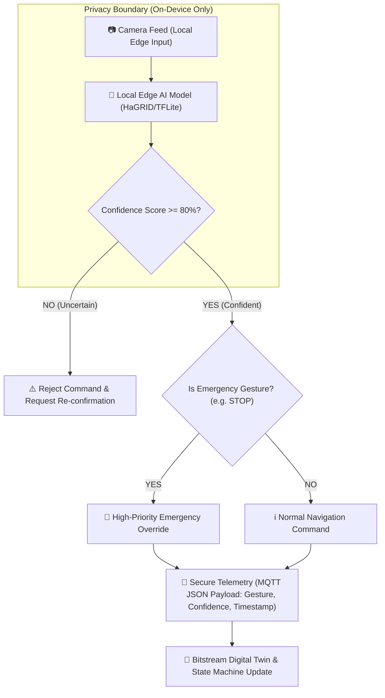

# 🛠️ TESAIoT PSoC Edge DevKit & RoboSignal Edge Specification Guide

เอกสารสรุปคุณสมบัติเชิงเทคนิคที่ถูกต้อง (Verified Technical Specs) ของบอร์ด **TESAIoT PSoC Edge DevKit** พร้อมข้อกำหนดโครงงาน **RoboSignal Edge: Edge AI Emergency & Gesture Control for Service Robots** สำหรับการแข่งขัน **TESAIoT Secure Edge AI Hackathon 2026**

---

## ภาคที่ 1: รายการเซนเซอร์และสเปกฮาร์ดแวร์จริง (Verified Hardware Specs)

### 1. 🧠 ชิปประมวลผล & AI Cores (PSoC Edge E84 Architecture)

* **ARM Cortex-M55 Core**: ชิปประมวลผลหลัก รองรับ **Helium Vector Extension (MVE)** สำหรับงาน Signal Processing และ Matrix Math (คำนวณ Random Forest, Decision Tree และส่วนประสานงานหลักบน CPU)
* **Ethos-U55 MicroNPU**: ชิปเร่งความเร็วฮาร์ดแวร์สำหรับ Neural Network (สมรรถนะสูงสุด 128 MACs/cycle) 
  * *เงื่อนไขการทำงาน*: เร่งความเร็วเฉพาะ Operator และ Layer ของโมเดลแบบ INT8 Quantized ที่ผ่านการคอมไพล์ด้วย **Vela Compiler** เท่านั้น
* **ARM Cortex-M33 Core**: ชิปประมวลผลย่อยสำหรับงาน Real-time Control และจัดการระบบสื่อสาร
* **Software Toolchain ทางการ**: ModusToolbox, TensorFlow Lite for Microcontrollers (TFLite Micro), Vela Compiler, และ DEEPCRAFT

---

### 2. 📡 เซนเซอร์บนบอร์ด (Onboard Sensors)

| เซนเซอร์ | ชิปที่ใช้ | รายละเอียดค่าวัด (Telemetry Data) |
|---|---|---|
| **6-Axis IMU** | **BMI270** | • **Accelerometer 3 แกน** ($a_x, a_y, a_z$) — วัดความเร่ง, แรงกระแทก • **Gyroscope 3 แกน** ($\omega_x, \omega_y, \omega_z$) — วัดความเร็วเชิงมุม • **Orientation** — มุม Roll, Pitch, Yaw และ Quaternion 3D |
| **3-Axis Magnetometer** | **BMM350** | • **สนามแม่เหล็ก 3 แกน** ($m_x, m_y, m_z$) — สำหรับทำเข็มทิศดิจิทัลระบุทิศทาง |
| **Temp & Humidity** | **SHT40** | • **อุณหภูมิแวดล้อม** (°C) และ **ความชื้นสัมพัทธ์** (%RH) |
| **Barometric Pressure** | **DPS368** | • **ความดันบรรยากาศ** (hPa) — สำหรับคำนวณระดับความสูง |

---

### 3. 🎛️ อุปกรณ์ I/O & ระบบเชื่อมต่อ (Peripherals & Connectivity)

* **TFT Display Screen**: หน้าจอสีบนตัวบอร์ดสำหรับแสดงผลสถานะหุ่นยนต์และค่าวัด
* **SW_BTN & ADC_POT**: ปุ่มกดฮาร์ดแวร์ Onboard Switch Button และตัวต้านทานหมุนอนาล็อก
* **UART Serial Interface**: สื่อสารความเร็วสูง `921600` Baud Rate ผ่าน USB
* **BLE & Wi-Fi Stack**: สื่อสารไร้สายระยะสั้น/ยาว (มีโฟลเดอร์ตัวอย่าง `ble-flet/` และ `ble-react/`)
* **Local Bitstream Services**:
  * `ws://127.0.0.1:9997` (Telemetry Stream)
  * `ws://127.0.0.1:8883` / `9998` (MQTT Broker)

---

## ภาคที่ 2: ข้อกำหนดโครงงาน RoboSignal Edge (Project Proposal)

### 📌 ข้อมูลพื้นฐาน
* **ชื่อภาษาไทย**: ระบบสั่งงานและหยุดหุ่นยนต์บริการฉุกเฉินด้วยท่ามือและการประมวลผล Edge AI
* **ชื่อภาษาอังกฤษ**: RoboSignal Edge: Privacy-Preserving Gesture Control & Emergency Override for Service Robots
* **ธีมการแข่งขัน**: Service Robotics (TESAIoT Secure Edge AI Hackathon 2026)

---

### 🎯 จุดเด่นหลักในการพิตช์ (Value Proposition & Pitch Hook)
> "หุ่นยนต์บริการที่ทำงานร่วมกับมนุษย์ในโรงพยาบาลหรือโรงแรม ต้องตอบสนองต่อคำสั่งฉุกเฉินได้ทันทีโดยไม่ต้องพึ่งพาอินเทอร์เน็ต และต้องรักษาความเป็นส่วนตัวของผู้ใช้ **RoboSignal Edge** ประมวลผลท่ามือฉุกเฉินภายในอุปกรณ์ (Edge AI) ไม่ส่งภาพวิดีโอดิบออกจากพื้นที่ และส่งเฉพาะคำสั่งที่ยืนยันแล้วไปควบคุม Digital Twin ผ่าน TESAIoT"

---

### 📊 Public Dataset ที่รองรับการทำ Demo
* **Dataset หลัก**: **HaGRID (Hand Gesture Recognition Image Dataset)**
  * ใช้สำหรับฝึก/ทดสอบการจำแนกท่ามือ เช่น `Stop (Palm)`, `Call`, `Timeout`, `Fist (Safe Mode)`
* **Dataset สำรอง (สำหรับ Keyword Spotting)**: **Google Speech Commands** (สำหรับคำสั่งเสียงฉุกเฉิน เช่น `Stop`, `Go`, `Help`)

---

### 🛡️ สถาปัตยกรรมระบบความปลอดภัย (Secure Edge Architecture)

---

### 🖥️ การตอบสนองของระบบหุ่นยนต์ (Gesture Mapping & State Machine)

| ท่ามือ (Gesture) | การตอบสนองของหุ่นยนต์ (Digital Twin Response) | ระดับความสำคัญ (Priority) |
|---|---|---|
| ✋ **Stop (Palm)** | หุ่นยนต์สั่งหยุดฉุกเฉินทันที (**Emergency Safe Stop**) | 🚨 High (Override All) |
| 🖐️ **Call** | หุ่นยนต์เปลี่ยนทิศทางเคลื่อนที่เข้าหาตำแหน่งผู้ใช้งาน | 🔵 Normal |
| ⏱️ **Timeout** | หุ่นยนต์สลับเข้าสู่โหมดพักภารกิจชั่วคราว (Pause / Standby) | 🔵 Normal |
| ✊ **Fist** | หุ่นยนต์สลับเข้าสู่โหมดปลอดภัยระดับสูง (Safe Mode / Lockout) | 🟡 Medium |
| ❓ **Low Confidence (< 80%)** | หุ่นยนต์ชะลอความเร็ว ไม่ทำตาม และแสดงสัญญาณไฟขอยืนยันอีกครั้ง | 🛡️ Security Guard |

---

### 🚀 ขอบเขตการพัฒนาและการนำเสนอ (Scope & Roadmap)

1. **รอบซอฟต์แวร์ (Software Demo Round)**:
   * รัน Web App ผ่านคำสั่ง `Serve Web App Folder over HTTP` ของ Bitstream Studio
   * ใช้ Webcam ดึงภาพท่ามือในเบราว์เซอร์ ประมวลผลด้วยโมเดล Hand Gesture (เช่น MediaPipe/TFLite Web)
   * ส่งคำสั่งควบคุมผ่าน MQTT (`ws://127.0.0.1:8883`) ไปยังหน้า Bitstream Digital Twin ให้กรรมการเห็นหุ่นยนต์สลับสถานะเรียลไทม์

2. **รอบฮาร์ดแวร์ (Hardware Round)**:
   * นำพอร์ตโมเดล Gesture/Vision ที่ผ่าน Vela Compiler ลงชิป **Cortex-M55 + Ethos-U55** บนบอร์ด PSoC Edge E84
   * เชื่อมต่อปุ่มฮาร์ดแวร์ **SW_BTN** และเซนเซอร์ **BMI270** บนบอร์ดเพื่อเสริมการยืนยันสถานะฉุกเฉินทางกายภาพ

---
*จัดทำขึ้นเพื่อใช้สำหรับการแข่งขัน TESAIoT Secure Edge AI Hackathon 2026*
